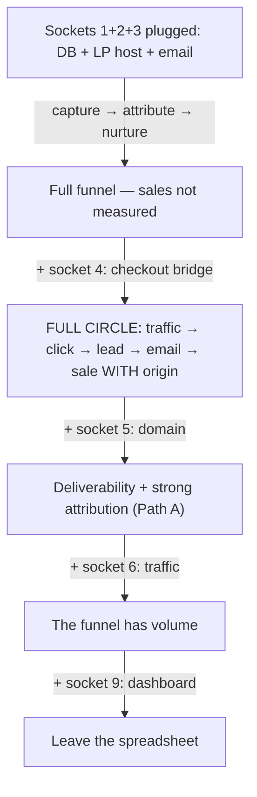

# Sockets — where the owner plugs their own tools

The pack ships pieces and contracts; the rest of the world enters through
**sockets**. A socket is an integration point: a data shape plus rules. A
**plug** is the concrete tool the owner chooses and fits into it. The pack
ships reference plugs; the socket is what matters.

## The unlock chain

## The 9 sockets

| # | Socket | Contract | Required? | Reference plug | Alternative plugs | Locked without it |
|---|---|---|---|---|---|---|
| 1 | Postgres database | Transactional idempotent clicks (`RETURNING (xmax = 0)`); 7/30/90 calendar-filled metrics; shared throttle state | Yes | Supabase (Lovable ships one; free tier) | Neon, Railway Postgres | No tracking, no throttle, no cockpit |
| 2 | LP hosting | Publication gate validates before any write | Yes | Vercel | Netlify, Cloudflare Pages (a Lovable page is not supported today — the LP emits a blueprint, not pasteable HTML) | The landing page never publishes |
| 3 | Email provider | Resend-style adapter; 1 email/lead/day; fail-closed outbox | Yes (for nurture) | Resend | Mailgun, Amazon SES, SMTP | Leads are captured and go cold |
| 4 | Checkout (sale source) | Attribution ends at the click; the bridge reads `firstTrackingClickId` or the same-domain cookie | The one that unlocks total potential | None — outside the pack by contract | Stripe, Mercado Pago, Pagar.me, Lovable checkout | The funnel never measures revenue |
| 5 | Domain + DNS | DKIM/SPF for the sender; cookie `Domain` attribute for attribution Path A | Should | Any registrar | Cloudflare, GoDaddy, Hostinger | Emails land in spam; Path A closed (Path B stays open) |
| 6 | Traffic | Tracked links with UTMs; analytics never blocks delivery | Should | claude-seo (organic) | Meta Ads, Google Ads, influencer links | Assembled funnel with no volume |
| 7 | SEO/GEO | Audit methodology; GEO citability | Optional | claude-seo (third-party, MIT) | Any SEO methodology | The Attract stage stays uncovered |
| 8 | AI generation | Anti-fabrication is supreme | Optional | Claude API | Any LLM, or none (manual copy) | Nothing breaks — copy becomes manual |
| 9 | Dashboard/reporting | 7/30/90 with absence ≠ zero | Optional today | The owner's spreadsheet | Metabase/Grafana, unified dashboard (roadmap) | The owner keeps the spreadsheet |

## Tiers

- **Must (1–3):** the funnel does not exist without them — plug first, in
  funnel order (Recipe B needs 1+2, Recipe C needs 1+3).
- **Should (5–6):** the funnel works without them but underperforms — the
  domain feeds deliverability and attribution; traffic feeds volume.
- **Optional (7–9):** accelerators and conveniences — nothing breaks while
  empty; copy becomes manual, reporting stays in the spreadsheet.

## Socket 4 — the revenue unlock

Every other socket improves a working funnel. Socket 4 is the only one that
changes what the funnel MEASURES: with it, the dashboard answers "how much
did the campaign sell" instead of "how many leads did it bring". The pack
stops at the click by contract — plugging checkout is the owner's move, and
`attribution-bridge.md` documents the two ways to do it.
