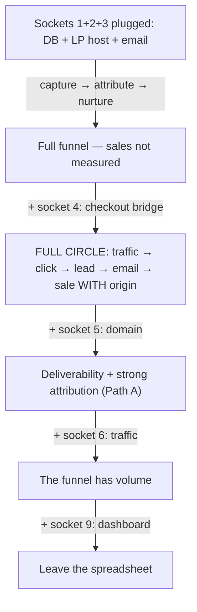

<p align="center">
  
</p>

<p align="center">
  
</p>

<h1 align="center">MARKETING 4.0</h1>

<p align="center">
  <strong>Digital Marketing in the Age of AI — the assembly manual for your marketing ecosystem, piece by piece, like LEGO.</strong>
</p>

> **Marketing 4.0 runs inside Claude Code.** One command installs it, one command starts it: `bash install.sh`, then `/marketing40-onboarding`.

<p align="center">
  <a href="https://github.com/luisroquette"></a>
  
  
  
</p>

---

## How to run

Marketing 4.0 is a set of agent skills that run **inside Claude Code** — not a
standalone program, not a server, and not something you upload to a chat bot.

1. Install [Claude Code](https://claude.com/claude-code) and sign in (one per operator).
2. Clone this repository and run `bash install.sh` inside the client workspace.
3. Open Claude Code in that workspace and run `/marketing40-onboarding`.

The wizard walks the team through credentials, gates, and the first campaign.

---

## Table of contents

- [In 60 seconds](#in-60-seconds)
- [The map: the ecosystem graph](#the-map-the-ecosystem-graph)
- [The thesis: why pieces, not a platform](#the-thesis-why-pieces-not-a-platform)
- [The funnel in depth](#the-funnel-in-depth)
- [The 5 pieces, one by one](#the-5-pieces-one-by-one)
- [The sockets: where the owner plugs their own tools](#the-sockets-where-the-owner-plugs-their-own-tools)
- [The contracts: the actual LEGO part](#the-contracts-the-actual-lego-part)
- [Recipes: ready-to-assemble flows](#recipes-ready-to-assemble-flows)
- [What the graph reveals](#what-the-graph-reveals)
- [Frequently asked questions](#frequently-asked-questions)
- [Ecosystem roadmap](#ecosystem-roadmap)
- [Honest limitations](#honest-limitations)
- [License](#license)
- [Step-by-step assembly tutorial](#step-by-step-assembly-tutorial)
- [Why each rule exists](#why-each-rule-exists)
- [Troubleshooting](#troubleshooting)
- [The pieces vs the market](#the-pieces-vs-the-market)
- [A day operating the full funnel](#a-day-operating-the-full-funnel)
- [The ecosystem's story](#the-ecosystems-story)
- [Maintainer quick guide](#maintainer-quick-guide)
- [Security model](#security-model)
- [What it costs to run](#what-it-costs-to-run)
- [Migrating from a closed platform](#migrating-from-a-closed-platform)
- [Images and videos in this repo](#images-and-videos-in-this-repo)
- [Why trust the graph](#why-trust-the-graph)
- [Assembly comparison](#assembly-comparison)
- [FAQ: extended edition](#faq-extended-edition)
- [Community and contributing](#community-and-contributing)
- [Changelog](#changelog)
- [The final word](#the-final-word)

---

## In 60 seconds

A marketing funnel has four stages: attract traffic, convert it into leads, nurture the leads, and measure everything. This superpack delivers every stage as an **independent piece** — an open MIT repository with Markdown contracts and deterministic validators — plus the **manual that shows how the pieces plug together**. You can assemble just the conversion layer (LP + tracking) in an afternoon, or the whole funnel (SEO → LP → tracking → email → metrics) over a few weeks. Each piece works alone; the set works as a system because the pieces reference each other through **contracts**, not coupled code. The interactive graph in this repo is the map of those connections — extracted from the systems' own documents, not hand-drawn.

The rest of this README is the manual: every piece in detail, every plug explained, ready-made recipes, and the questions you would ask before assembling.

---

## The map: the ecosystem graph

**[Open the interactive graph](assets/grafo-marketing-4.0.html)** — download the file and open it in your browser. It holds **263 concepts and ~357 connections** extracted from the repositories' contracts, clustered by funnel stage — including the socket registry (the 9 sockets wired to their pieces).

Prefer a plain-text map? **[How the pieces communicate](docs/HOW-THE-PIECES-COMMUNICATE.md)** — every connection between the pieces and the physical mechanism behind it.

The graph was not drawn: it was **built from the repos' own documents** (SKILL.md, references/, docs/, READMEs) with the graphify pipeline — semantic extraction by agents, then ten rounds of lapidation to deduplicate concepts and validate every edge against textual evidence. Every edge in the graph has a source sentence in the docs; edges without evidence were **rejected** during lapidation (e.g., the autoblog does not use tracking links, and the graph says so through the absence of that edge).

What the graph reveals at a glance:

- **The hub is the email engine** — MailMKT concentrates 45 connections, because the cockpit touches throttle, dispatcher, outbox, tracking, and dashboard at once.
- **Three principles run across the repos**: "absence is never zero", "analytics never blocks delivery", and "cascading gates" appear in documents from different systems without copying each other — the graph connects them by semantic similarity.
- **The incident is the architecture**: the node of the 08/17 incident (three emails in one hour to a real lead) connects to the throttle, the dispatcher, and the outbox — the documented reason each of them exists.

---

## The thesis: why pieces, not a platform

Closed marketing platforms sell the whole funnel at once: you pay for stages you do not use, you cannot audit the rules that govern your money, and you get locked in when the contract changes. This superpack starts from the opposite thesis:

1. **Each funnel stage is a different problem** — auditing SEO is not nurturing leads, and nurturing leads is not attributing sales. Solving all six with a single product produces a product that is mediocre at all six.
2. **The stages only need to meet at the contracts** — the LP needs to know what a click is (the tracklink defines it); the email needs to know who a lead is (the LP delivers it). Three contract tables solve this; no code coupling is required.
3. **Auditability is the product** — the rules are prose you read and validators you run. "How do we know the throttle works?" has an answer: `npm test`, 107 tests.
4. **Honesty is the brand** — absence is never zero, anti-fabrication beats a pretty page, and the limitations are written down in every repo. The graph even records the connections that do NOT exist (because the docs do not support them).

If you want a one-afternoon funnel, assemble two pieces. If you want the operating system of your marketing, assemble all five — the same discipline, the same visual standard, the same contracts.

---

<p align="center">
  <br>
  <sub>The funnel, animated — the pieces snapping together (Higgsfield video in loop; the original .mp4 lives in assets/)</sub>
</p>

## The funnel in depth

The funnel is not a linear sequence of tools — it is a chain of **responsibility transfers**, and every transfer is a contract. Understanding where one piece ends and the next begins is what makes assembly predictable.

### Attract — traffic enters

Two engines produce organic traffic: the **SEO/GEO audit** (the claude-seo plugin, which optimizes for classic search AND for AI citation — every recommendation answers "how would we know it failed?") and the **autoblog** (continuous editorial content, generated from real sources with a compliance gate at runtime). Their responsibility ends at the click: **they do not convert**. The blog attracts; the page converts — and that is why the autoblog, by contract, does not emit tracking links: attribution belongs to the next piece.

### Convert — the click becomes a lead

The **LP engine** builds the sales page (six models, four gates, anti-fabrication as the supreme rule), and the **tracklink** owns the click contract. At publication time, the LP creates the tracked link for the CTA; when the visitor converts, the page records `firstTrackingClickId` on the lead. The responsibility transfer is double: the page delivers the lead to the funnel, and delivers the lead's **origin** to attribution.

### Nurture — the lead does not go cold

**MailMKT** receives the lead through the intake contract and runs the 25-day sequence under a shared throttle — one email per lead per day, guaranteed by 107 tests. Every email CTA goes out as a `mailmkt-<slug>` tracklink, so nurture also attributes. The incident that created this piece is documented in the repo: a real lead received three emails in one hour, and the throttle is the scar that prevents repetition.

### Measure — all the time

The tracklink **metrics contract** (7/30/90 calendar-filled windows, absence ≠ zero) feeds the unified dashboard, and the MailMKT cockpit contributes its documented queries. Measuring is not the last stage of the funnel: it is the layer that crosses all the others.

---

## The 5 pieces, one by one

### Piece 1 — SEO/GEO (Attract)

- **What it does:** audits your site for classic search and AI search with a plugin of 25 sub-skills and 18 specialist agents. Its declared differentiator: **falsifiability** — every recommendation carries its own failure criterion.
- **Repo:** [`AgriciDaniel/claude-seo`](https://github.com/AgriciDaniel/claude-seo) (MIT, third-party — referenced, not forked)
- **Install:** `git clone https://github.com/AgriciDaniel/claude-seo.git`
- **Plug:** no dependencies — it is the front door. The connection to the rest of the funnel is indirect: the LP's SEO gate (metaTitle/metaDescription/JSON-LD) uses the same pattern, and the audited content is what the autoblog publishes.
- **Real imagery:** the repo includes demo GIFs of the plugin running in the terminal and the author's real growth chart.

### Piece 2 — Autoblog (Attract)

- **What it does:** autonomous editorial content — articles generated from real sources, with a compliance guard at runtime. Living reference in `the production site` (`app/api/cron/generate-article`).
- **Plug:** none — by contract it does not emit tracking links; the blog attracts, the LP converts, and the contract keeps that boundary explicit.
- **Why it matters:** continuous organic traffic is the cheapest asset in the funnel — and the metrics contract is what tells you when it stops working.

### Piece 3 — LP Engine (Convert)

- **What it does:** sales pages from a brief or a URL, with **6 models** (universal, course, event, capture, squeeze, launch), **4 gates** (structure, rules, WCAG AA contrast, SEO) and **anti-fabrication** as the supreme rule — a price, deadline or credential that is not in the source is omitted, never invented.
- **Repo:** [`luisroquette/My_LP_Makes_Neil_Proud`](https://github.com/luisroquette/My_LP_Makes_Neil_Proud)
- **Install:** `git clone https://github.com/luisroquette/My_LP_Makes_Neil_Proud.git`
- **Plug:**
  - → **Tracklink**: every published CTA becomes a tracked link; the lead records `firstTrackingClickId`/`lastTrackingClickId`.
  - → **MailMKT**: the captured lead enters nurture through the intake contract.
- **Bedrock clause:** the capture form has 3 fields (name + phone + email). Reducing it requires the owner's approval — the whole funnel depends on a lead reachable by phone.
- **Real imagery:** the deterministic validator running in the terminal (below).


### Piece 4 — Tracklink UTM (Convert/Measure)

- **What it does:** the owner of the tracking contract — creation (`mailmkt-`/UTM slugs, query-free destinations, anti-loop), click (transactional, idempotent, `RETURNING (xmax = 0)`), attribution (first/last click, camelCase on the lead, snake_case on the purchase), health (SSRF guard with per-redirect-hop revalidation, datacenter-block detection) and metrics (7/30/90 calendar-filled).
- **Repo:** [`luisroquette/My_UTMs_Make_Me_Proud`](https://github.com/luisroquette/My_UTMs_Make_Me_Proud)
- **Install:** `git clone https://github.com/luisroquette/My_UTMs_Make_Me_Proud.git`
- **Plug:** LP (link producer), MailMKT (every CTA), unified dashboard (metrics). The core is channel-agnostic: each new channel is a directory in `integracoes/` with its hostname→utm_source map.
- **Real imagery:** the validator with the 13 regression cases (below).

<p align="center">
  <br>
  <sub>The tracking cycle, animated — the link crosses the 302 gate to its destinations (Higgsfield video in loop)</sub>
</p>


### Piece 5 — MailMKT (Nurture)

- **What it does:** the email cockpit — shared throttle (1 email/lead/day + 20h floor), one cron with priority dispatcher, durable outbox (claim/lease, 23h dead-letter, fail-closed), copy floor at save AND at send, and the demo dashboard with 6 screens.
- **Repo:** [`luisroquette/My_MailMKT_makes_Neil_Proud`](https://github.com/luisroquette/My_MailMKT_makes_Neil_Proud)
- **Install:** `git clone https://github.com/luisroquette/My_MailMKT_makes_Neil_Proud.git` · demo: `cd dashboard && npm install && npm run dev`
- **Plug:** LP (lead intake), Tracklink (`mailmkt-<slug>` CTAs), Resend/Supabase (faithful adapters) — the core is ports-and-adapters, zero dependencies.
- **Real imagery:** the four screens of the demo dashboard (below).

<p align="center">
  <br>
  <sub>The cockpit, animated — throttle, five motors and the collision calendar (Higgsfield video in loop)</sub>
</p>

<p align="center">
  <table>
    <tr>
      <td align="center"><br/><sub>Cockpit hub</sub></td>
      <td align="center"><br/><sub>14-day calendar</sub></td>
    </tr>
    <tr>
      <td align="center"><br/><sub>Campaigns</sub></td>
      <td align="center"><br/><sub>Copy editor with the floor</sub></td>
    </tr>
  </table>
</p>

---

## The sockets: where the owner plugs their own tools

The pieces are only half of the system. The other half is the owner's
existing stack — and the two halves meet at **sockets**: the integration
points where a chosen tool plugs in. A socket is a data shape plus rules; a
**plug** is the concrete tool that fulfills it. The pack ships reference
plugs; the socket is what matters.



| # | Socket | Required? | Reference plug | Without it |
|---|---|---|---|---|
| 1 | Postgres database | Yes | Supabase | No tracking, no throttle, no cockpit |
| 2 | LP hosting | Yes | Vercel | The landing page never publishes |
| 3 | Email provider | Yes (for nurture) | Resend | Leads are captured and go cold |
| 4 | Checkout (sale source) | The one that unlocks total potential | None — outside the pack by contract | The funnel never measures revenue |
| 5 | Domain + DNS | Should | Any registrar | Emails land in spam; attribution Path A closed |
| 6 | Traffic | Should | claude-seo (organic) | Assembled funnel with no volume |
| 7 | SEO/GEO | Optional | claude-seo (third-party) | The Attract stage stays uncovered |
| 8 | AI generation | Optional | Claude API | Nothing breaks — copy becomes manual |
| 9 | Dashboard/reporting | Optional today | The owner's spreadsheet | The owner keeps the spreadsheet |

Socket 4 is the only one separating "funnel operating" from "funnel measuring
money" — the pack stops at the click by contract; plugging checkout is the
owner's move (see [Migrating from a closed platform](#migrating-from-a-closed-platform)).

The full registry — contracts per socket, alternative plugs, and the
per-socket checklist the onboarding wizard renders — lives in
[`.claude/skills/marketing40-onboarding/references/sockets.md`](.claude/skills/marketing40-onboarding/references/sockets.md).
The wizard ends every onboarding with a `SOCKETS.md` snapshot: the owner's
own stack, socket by socket, with whatever stays locked while a socket is
empty.

---

## The contracts: the actual LEGO part

The pieces do not call each other through code — they reference each other through **Markdown contracts**, each with a declared owner. When two contracts disagree, the owner wins. This table is the assembly map:

| Contract | Owner | Consumers | Central rule |
|---|---|---|---|
| What a click, a lead and a purchase are | Tracklink (`references/nucleo/`) | LP, MailMKT, dashboard | Transactional and idempotent: replay never counts twice |
| Capture form (3 fields) | LP (bedrock clause) | MailMKT (intake) | Name + phone + email — reducing it requires the owner's approval |
| `mailmkt-<slug>` slug + UTMs | Tracklink (mailmkt integration) | MailMKT (every CTA) | One tracking link per occurrence, never per lead |
| 7/30/90 calendar-filled metrics | Tracklink (`metricas.md`) | Unified dashboard | Absence ≠ zero — a day without data is an explicit zero, not a missing row |
| Publication gate never bypassed | LP | — | Validates BEFORE any write |
| Copy floor at save AND at send | MailMKT (`piso.ts`) | — | Rejected copy falls back to the seed and logs — it never ships |
| Analytics never blocks delivery | the three repos | everyone | A metrics failure degrades and logs; the redirect is the product |
| Anti-fabrication above everything | LP (supreme rule) | content generation | A price/deadline/credential absent from the source is omitted, never invented |

**What a click is** is owned by the tracklink because the click is the currency of the whole funnel. If the LP counted clicks its own way and the email counted them another, the same money would be measured twice in two different languages. The contract fixes the vocabulary: one transactional, idempotent record — replaying an event never counts it twice.

**The capture form** is a bedrock clause because the funnel's downstream pieces are all built on one assumption: a lead is reachable by phone. The nurture sequence, the WhatsApp seller and the human closer all need it. A form that only asks for email would silently change what a lead *is* — and that decision belongs to the business owner, not to a template.

**The `mailmkt-<slug>` convention** exists so that any email CTA is traceable at a glance: the slug prefix identifies the channel before you even open the link. One tracking link per occurrence — never reused across leads — is what makes first/last-click attribution honest instead of approximate.

**The metrics contract** is the least glamorous and the most important: a report that treats a failed read as a zero hides the moment your tracking pipeline died. Calendar-filled windows plus the absence-≠-zero rule mean a missing day is visible as a missing day, and that is the only way an operator finds a broken pipeline before the campaign ends.

**The publication gate** validates before any write because a published page is public: there is no "fix it later" for a page that already served a thousand visitors. The gate ordering is the contract — never the other way around.

**The copy floor at both points** exists because a gate that only runs in the editor can be bypassed by editing the database directly. Save-time keeps the editor honest; send-time keeps the pipeline honest.

**Analytics never blocks delivery** because the redirect is the product: if recording the click fails, the visitor still lands on the page. A tracking system that can take down your conversion is a liability, not a feature — the failure degrades and logs instead.

**Anti-fabrication** is supreme because every other rule exists to protect trust, and a fabricated price destroys it in one pageview. When the source does not state it, the page does not state it — the omission is the feature.

**Why Markdown contracts instead of SDKs?** Because the consumer can be any stack — the contract is prose readable by humans and agents alike, and the deterministic validator is the machine that verifies. No piece imports code from another; all of them read the same rules file. That is what allows assembling the funnel with two pieces today and five tomorrow without rewriting anything.

---

## Recipes: ready-to-assemble flows

### Recipe A — Full funnel (the entire ecosystem)

1. **Attract:** clone claude-seo and run the audit on your site; the autoblog publishes continuous content (reference in the production site).
2. **Convert:** clone LP + Tracklink → create the page (brief or URL), plug tracking at publication, validate with `validar-blueprint.py`.
3. **Nurture:** clone MailMKT → run `npm test` (107 tests) → point the intake contract at the LP's leads → run the demo (`cd dashboard && npm run dev`).
4. **Measure:** the unified dashboard consumes the tracklink metrics + the cockpit queries — clicks per channel, leads per origin, sends per motor, link health.

### Recipe B — Conversion only (2 pieces, ~30 minutes)

LP Engine + Tracklink. The page captures the lead AND attributes the origin. Ideal for validating an offer before building the whole funnel.

### Recipe C — Nurture only (1 piece, self-contained)

MailMKT with throttle, outbox and demo dashboard. Ideal for existing lists that need send discipline.

### The expansion rule

Add pieces in funnel order, not catalog order: only assemble Nurture after Convert produces leads, and only assemble Amplify after the funnel converts. Each piece's contract expects the previous one to exist.

---

## What the graph reveals

- **The hub is email:** MailMKT concentrates ~45 connections — the cockpit touches throttle, dispatcher, outbox, tracking and dashboard at the same time.
- **Three principles cross the repos:** "absence is never zero", "analytics never blocks delivery" and "cascading gates" — the graph connects them by semantic similarity between documents from different systems.
- **The incident is the architecture:** the 08/17 incident node (three emails in one hour) connects to the throttle, the dispatcher and the outbox — the documented reason each of them exists.
- **Absences are information too:** the graph records the connections that do NOT exist (the autoblog does not use tracking links) — because lapidation rejected edges without evidence in the docs. An honest map shows what is not connected.

---

## Frequently asked questions

**Where do I start?** With Recipe B — two pieces, half an hour, and you already have conversion with attribution. The full funnel is a natural expansion.

**Do I need every piece to work?** No. Each piece works alone; the contracts exist for when you plug the next ones.

**Can I use just the skills, not the code?** Yes — the skills are the portable methodology; the public repos (LP, Tracklink, MailMKT) are the reference implementations with validators and tests.

**claude-seo is third-party — how does it enter the pack?** Referenced, not forked: MIT, with clear link and credit. It occupies the Attract stage, which was the ecosystem's gap.

**What does the graph have to do with the manual?** The graph is the proof that the manual's connections exist in the contracts — every edge has a source sentence. The manual is the human reading; the graph is the navigable map.

**Can I contribute a new piece?** Yes — the pattern is: a repo with Markdown contracts + deterministic validators + regression tests, and a plug that references the existing contracts (see `integracoes/` in the tracklink for the template).

**What does "absence is never zero" mean?** A day without data is an explicit zero; a missing field is missing. A report that confuses the two hides the moment your tracking stopped working — and the graph shows this principle across the three repos.

**Why is the capture form a bedrock clause?** Because the whole funnel depends on a lead reachable by phone — nurture, WhatsApp and closing. Reducing it to "email only" changes what a lead IS, and that decision belongs to the business owner, not to a template.

**How much does it cost?** Everything is MIT, zero licenses, zero vendors. The real cost is your assembly time — and the recipes say exactly what to assemble first.

---

## Ecosystem roadmap

**Now — consolidation.** The three in-house repos published and interoperating; claude-seo referenced at the Attract stage; the graph lapidated (10 rounds) and the manual published.

**Next — the unified dashboard.** The tracklink metrics contract + the MailMKT cockpit's documented queries meet on one screen: clicks per channel, leads per origin, sends per motor, link health.

**Later — new pieces.** Each new channel enters as a tracklink integration (template ready); each new LP model follows the 16-point checklist; each new MailMKT motor follows the documented checklist.

**Finally — the graph as a product.** The graph grows with the repos (the corpus is re-extracted on every contract change) and becomes the official map for any new consumer of the ecosystem.

---

## Honest limitations

- **The manual covers the 5 public pieces** — the interactive graph artifact (263 nodes) also maps the wider production ecosystem, because the extraction is honest about the docs; the pack itself ships and documents only the five marketing pieces.
- **The autoblog's code is a living reference, not a public repo** — it lives in `the production site`; its public contract is the one described here.
- **The graph covers the contracts, not all the code** — 263 concepts extracted from the documents; the repos' code has its own graphs (MailMKT has the port graph).
- **Attribution ends at the purchase** — the tracklink cookie records the origin on the purchase (first/last click); what happens after the purchase is outside the pack's scope. Documented, not hidden.
- **This manual is a snapshot of August 2026** — the graph updates by re-extracting the corpus; the README updates when the pieces change version.

---

## License

MIT — each piece keeps its own license (all MIT). claude-seo is MIT by its original author.

---

## Step-by-step assembly tutorial

### Assembling Recipe B (conversion) in 30 minutes

**Step 1 — Clone the two pieces.**
```bash
git clone https://github.com/luisroquette/My_LP_Makes_Neil_Proud.git
git clone https://github.com/luisroquette/My_UTMs_Make_Me_Proud.git
```

**Step 2 — Validate the machines.** Each repo ships a deterministic validator that you run BEFORE using it — if the self-test fails, the machine is broken:
```bash
python3 My_LP_Makes_Neil_Proud/scripts/validar-blueprint.py --input My_LP_Makes_Neil_Proud/examples/example-briefing-input.json
python3 My_UTMs_Make_Me_Proud/scripts/validar-tracking-link.py --self-test
```
Two "FORM VALID"/"SELF-TEST OK" mean the pieces are intact.

**Step 3 — Create the page.** In the LP repo, write a brief (offer, audience, model, objective — the five quick decisions are selects, not JSON) or paste the URL of an existing page. The resulting blueprint passes the four gates before publishing.

**Step 4 — Plug tracking.** At publication, the tracklink contract kicks in: the page's CTA becomes a tracked link with slug and UTMs, and the lead records the first-click id. The LP's v2.1.0 plug references the contract — you do not write tracking code, you fulfill the contract.

**Step 5 — Check attribution.** The first lead that converts carries `firstTrackingClickId`. The answer to "where did this come from" is now a column, not an opinion.

### Assembling Recipe A (full funnel)

Recipe A is Recipe B + four pieces, in funnel order:

1. **Before converting, attract** — run claude-seo on your site (full audit with the plugin's 32 commands) and turn on the autoblog (reference: `the production site/app/api/cron/generate-article`).
2. **Assemble conversion** (complete Recipe B).
3. **Plug nurture** — in the MailMKT repo: `npm install && npm test` (107 green), point the intake at the LP's leads, configure throttle and schedules through the demo's rules screen. Every email CTA goes out as `mailmkt-<slug>` automatically.
4. **Measure** — the unified dashboard consumes the tracklink metrics + the cockpit queries; the tracklink cookie records the origin on every purchase.

### Once assembled: what you gain

- **One answer per report question:** where the lead came from (first-click), who closed (last-click), how many emails each lead received (throttle), which links are broken (health).
- **Zero deploys to change rules:** cadence, schedules, audiences and copy change through screens, not commits.
- **Testable guarantees:** 107 tests in email, 13 cases in tracking, gates in the LP. If something regresses, the test fails.

---

## Why each rule exists

The contract rules are not preferences — each one has a documented incident or risk behind it. This section is the manual's "why":

**1 email/lead/day throttle.** A real lead received three emails in one hour (launch 09:30, drip 10:01, mail mkt 10:30) because five motors had five independent throttle states. The fix — one shared state per round — is the heart of MailMKT, and a regression test fails the build if the old routes return.

**Gate at save AND at send.** The copy floor existed in the editor, but the sender never consulted it — copy edited directly in the database would pierce the gate. The contract demands both points because the review found the hole.

**Dry mode with zero side effects.** The dispatcher's preview once sent a real email and deleted orphan reservations in inspection mode. The current rule: dry sends nothing, writes no tracking, cleans nothing — and a test asserts it.

**Absence is never zero.** Three real bugs in three repos treated missing data as zero: dashboard blocks showed "0 sent" when the read had failed. The rule exists because a false zero sends the operator hunting for a problem in the campaign instead of in the pipeline.

**Anti-fabrication above everything.** URL extraction builds the blueprint only from what exists on the page — a missing price is a missing price. The rule is supreme because a pretty page with an invented price destroys the trust the entire funnel needs to convert.

**Analytics never blocks delivery.** If click recording fails, the visitor is redirected anyway. The rule is absolute because a tracking system that drops the redirect drops the conversion — the cost of an unmeasured click is lower than the cost of a lost customer.

**Fail-closed outbox.** A timeout or 5xx is ambiguous: the email may have gone out. The reservation is preserved and the email is never resent in the same round — a duplicate is worse than a gap, and the retry waits the 20-hour floor.

**Redirects re-validate the SSRF guard.** A public destination that redirects to a private IP would bypass the guard if only the first host were checked. The rule covers the bypass, not just the happy path.

**Renames do not propagate.** Renaming a slug changes a public URL; links already issued keep the old slug. The rule is documented (not hidden) so consumers design around it — tools that pretend to migrate automatically produce broken links in production.

---

## Troubleshooting

**The LP publishes but the CTA is not tracked** — the tracklink plug was not fulfilled: check that the publication contract (`references/publicacao/contrato-tracklink.md`) is referenced and that the link was created with the validator.

**A lead received two emails on the same day** — impossible by construction, so something pierced it: check whether the throttle was loaded AFTER the orphan-reservation cleanup (inverting the order frees a blocked lead) or whether the email left through an old route (the regression test covers this).

**The dashboard shows zero sent but the cron ran** — a failed read is `null`, never zero. A real zero means a round without candidates; a `null` means a broken read. The distinction is the contract.

**The autoblog stopped publishing** — check the dashboard health: the metrics contract makes a silent pipeline visible as a missing day, never as a zero.

**The click does not count in the report** — check whether it was HEAD/prefetch (excluded by contract), whether the link loops through `/t/` (the validator rejects at creation) or whether the counter was incremented outside the transaction (the rule is `RETURNING (xmax = 0)`).

**The graph does not open** — download `assets/grafo-marketing-4.0.html` (do not open it through GitHub's preview) and open it locally in the browser.

---

## The pieces vs the market

For each stage, what the market sells and what the piece delivers:

| Stage | The market | The piece |
|---|---|---|
| Attract | R$ 5-10k/month SEO audits, PDF report | claude-seo: executable audit with falsifiability — every recommendation says how you would know it failed |
| Attract | Article generator with generic copy | Autoblog with runtime compliance gate and its own monitoring |
| Convert | Closed page builders, no contract | LP engine with 6 models, 4 gates and anti-fabrication — the page is auditable |
| Convert/Measure | A UTM spreadsheet maintained by hand | Tracklink with a 13-case validator — the link is the contract |
| Nurture | Email platform with invisible rules | MailMKT with throttle, outbox and floor — 107 tests you can run |
| Measure | A monthly funnel report | Calendar-filled metric contracts + the unified dashboard |

The difference is not price (everything is MIT) — it is **auditability**. On a platform, the rule that governs your money is invisible. Here, the rule is a Markdown file you read and a test you run.

---

## A day operating the full funnel

At 10:00, the MailMKT dispatcher asks the agenda who is due: mail mkt and the evergreen track are both up, and the shared throttle guarantees no lead receives more than one email — even with two motors in the same round. A lead clicks the email's CTA: the tracking link records the click transactionally and redirects to the LP in milliseconds. On the LP, they convert: the lead records the first-click id and enters the nurture intake. At night, the autoblog publishes the day's article. The unified dashboard summarizes everything on one screen: clicks, leads, sends, health.

No step of that day required a deploy. Cadence, schedules, audiences and copy change through screens; the rules change through a contract with a test; and every number in the report has a source line in the graph.

---

## The ecosystem's story

The superpack was not designed top-down — it was **extracted** from a production system, piece by piece, in August 2026:

1. **The incident.** A real lead receives three emails in one hour. The investigation finds five motors with five independent throttles — and the cockpit (shared throttle, one cron, outbox) is born as the fix.
2. **The extraction.** Each production system becomes a public skill with Markdown contracts and deterministic validators: first tracking (v1.0.0), then the LP (v2.1.0 with the tracking plug), then email (v2.0.0 with the full cockpit).
3. **The lapidation.** Each repo goes through adversarial review rounds — 36 findings in MailMKT, 11 in tracklink, 9 in the LP — with a regression test for every bug class, and the criterion of two consecutive clean rounds before publishing.
4. **The graph.** The repos' contracts become a corpus, graphify extracts 263 concepts and ~357 connections, and ten lapidation rounds deduplicate and validate every edge against textual evidence.
5. **The manual.** This README — the human reading of the graph, with the pieces, the plugs and the recipes.

The order matters: the system existed before the product, the contracts before the manual, and the graph before the map. That is why every claim in this README has an origin in the repos — and the absences are documented too.

---

## Maintainer quick guide

**You run the operation and want to know what to watch:**

- **Every day:** glance at the unified dashboard — clicks, leads, sends, link health. The metrics contract makes anomalies visible as gaps, never as zeros.
- **Every copy change:** run the floor before saving (the editor already does this) and check the gate at send.
- **Every monthly report:** trust the tracklink's calendar-filled windows; if a day is absent (not zero), tracking stopped — investigate the pipeline before the campaign.
- **Every new rule:** write the contract first, the test alongside, and run the self-test. The repo rule is: fix and regression in the same commit.

**You are a developer and want to plug a new piece:**

1. Read the owner's contract (e.g., the tracklink's `references/nucleo/`).
2. Create the integration directory (the `modelo-nova-integracao.md` template is ready).
3. Write the validator for your link/page/campaign shape.
4. Open a PR — the bar is the regression test in the same commit.

---

## Security model

The pieces were extracted from a production system, and their security posture is part of the contract:

- **SSRF guard with per-hop revalidation** — the tracking link validates the destination host, and re-validates on every redirect hop, so a public URL that redirects to a private IP does not turn the tracker into an internal-network proxy.
- **Loop rejection at creation** — a link whose destination loops back into `/t/` is rejected by the validator before it ever exists.
- **Idempotent, transactional clicks** — the counter increments inside the same transaction that writes the click (`RETURNING (xmax = 0)`), so a replayed event can never double-count a conversion.
- **Fail-closed outbox** — an ambiguous failure (timeout/5xx) preserves the reservation instead of resending: duplicates are worse than gaps.
- **Dry mode with zero side effects** — inspection modes cannot send, write tracking or clean state; a test asserts each one.
- **Runtime compliance gates** — the autoblog validates its output at runtime, not only at authoring time; a guard that only runs in the editor can be bypassed by the database.
- **Least-privilege database adapters** — the Supabase adapter ships with explicit `REVOKE`/`GRANT` RPCs, so the application role gets the surface it needs and nothing else.

The posture in one line: every external call is validated, every write is transactional, and every failure mode has a defined behavior — the tests are the proof.

---

## What it costs to run

The pack is MIT, but "free" and "zero cost" are different claims. Here is the honest breakdown:

- **Licenses:** zero. All pieces are MIT; no per-seat fees, no vendor lock-in.
- **Runtime:** whatever your infrastructure already costs. The cockpit and the tracking layer need a Postgres (Supabase works, including its free tier) and an email provider behind the Resend-style adapter. The LP runs on any host (the reference uses Vercel). The dashboard demo runs entirely on your machine with mocked data.
- **AI generation:** only if you use it — the LP models and the email copy can be written by hand; the AI is an accelerator, not a dependency.
- **The real cost is time:** each recipe states its assembly estimate, and the contracts exist so that plugging a piece is reading, not reverse-engineering.

Nothing in this pack charges you. What it demands is discipline: read the contract, run the validator, keep the test green.

---

## Migrating from a closed platform

Moving an existing operation into the ecosystem, piece by piece:

1. **Export your list first** — a CSV of leads with name, phone and email fits the intake contract as-is. The capture-form bedrock clause is the shape your data must match, not the shape of someone else's template.
2. **Start with Recipe C (nurture)** if your list is your biggest asset — the throttle and the outbox improve send discipline from day one, and the dashboard demo shows the cockpit without touching your current platform.
3. **Then Recipe B (conversion)** — new pages go through the LP + tracklink from day one, so new leads arrive already attributed while old traffic keeps running on the old stack.
4. **Keep the closed platform during the transition** — the expansion rule is funnel order, not big-bang. The pieces interoperate by contract, so nothing forces a cutover date.
5. **Compare honestly** — the 7/30/90 metrics contract gives you the same calendar on both sides; the first report that shows the difference is your migration report.

The trap to avoid is re-implementing the closed platform inside the new stack. The pack's thesis is the opposite: each piece does one stage, and the contracts are the only place they touch.

---

## Images and videos in this repo

Every product image is a **real capture of the systems** (terminals running the validators; the four demo dashboard screens). The covers and videos are AI-generated in the the shared visual standard (`#1A1524` background, `#7B2FBE` purple, `#C9A7FF` lilac, the three logo waves) — the videos with Higgsfield FLUX 3 Video and the covers with gpt-image-2. The videos enter this README as **looping GIFs** because GitHub does not render the `<video>` tag — the original `.mp4` files remain in `assets/` for download. The graph is the repo's most honest artifact: every edge has a source sentence in the documents.

---

## Why trust the graph

A marketing map is usually a pretty slide drawn by a consultant. This graph is different on three counts:

1. **Extracted, not drawn.** The 263 nodes come from semantic extraction of the repos' own documents — every node has a source file and every edge has a supporting sentence. No edge was added without evidence; those without any were rejected across ten lapidation rounds.
2. **Lapidated with a convergence criterion.** Every review round hunted for duplicates, orphans, unsupported edges and missing connections — and the loop only stopped when two consecutive rounds found nothing. Each round's artifacts (`.lapidacao_r1.json` through `.lapidacao_r10.json`) are the process's audit trail.
3. **Honest about absences.** The graph records what is NOT connected: the autoblog does not use tracking links. A map that only shows connections sends you hunting for an integration that does not exist; this one shows the real boundary of each piece.

---

## Assembly comparison

| Recipe | Pieces | Estimated time | What you gain |
|---|---|---|---|
| C — Nurture | 1 | 1 hour (clone + tests + demo) | Send discipline with throttle and outbox |
| B — Conversion | 2 | ~30 minutes to 1 afternoon | A page that converts AND attributes |
| A — Full funnel | 5 | 1-2 weeks, in funnel order | The entire marketing system, auditable |

The times are assembly times, not learning times — each repo has its own README with the full cycle and the contracts. The real learning is reading the contracts once; after that, operating is screens and one daily email.

---

## FAQ: extended edition

**Does the funnel work without claude-seo?** Yes — it is the organic-acquisition piece; you can start with paid traffic or existing lists. The Attract stage needs only ONE engine for the funnel to run.

**Why does the autoblog not emit tracking links?** Because the funnel's boundary is the converting click. The blog attracts and educates; the LP converts and attributes. Emitting tracking from the blog would mix two responsibilities and inflate first-click with traffic that never converts. The edge's absence in the graph is the documentation of that decision.

**What if I want a new channel (WhatsApp, ads)?** The tracklink's `modelo-nova-integracao.md` template defines the pattern: one directory per channel, the hostname→utm_source map, and the referenced contract — the core does not change. Ads and WhatsApp are next in the roadmap.

**What happens when a contract changes?** The contract owner changes the Markdown, the validator gains the new rule with a regression test in the same commit, and consumers see the change in the owner's repo diff. Nothing breaks silently — the consumer's test fails if the contract changed incompatibly.

**Why are regression tests mandatory, not optional?** Because a production system's memory is short: a fix applied today can be removed inadvertently tomorrow. The only permanent guardian is a test that breaks the build. Every bug class in this ecosystem — from the render XSS to the dry mode that sent emails — has its test, in the same commit as the fix.

**What is the graph for, besides navigation?** It is the onboarding map for anyone new to the ecosystem (answer "how do the pieces relate" by pointing at the graph), the audit trail of connection decisions (every edge has an origin), and the base of the unified dashboard (the communities are the screen's modules).

**Does this repo replace the others?** No — it is the index and the manual. The repos remain the owners of their contracts and code; this repo references. The pattern is the ecosystem's own: the owner wins, consumers reference.

**How does the visual standard work across the three repos?** The shared visual standard (`#1A1524` background, `#7B2FBE` purple, `#C9A7FF` lilac, Inter, the three-wave logo) is saved and applied to covers, terminals, dashboards and READMEs — any future piece inherits the pattern.

**Can I commercialize services on top?** Yes — the superpack is MIT. What the ecosystem sells is discipline: auditing, assembling and operating the funnel. The software is the vehicle; the contract is the product.

**Is this a framework I must adopt entirely?** No — every piece is independently useful. The tracking validator alone replaces a spreadsheet; the LP validator alone audits your pages; the cockpit alone disciplines an existing list. The superpack only adds the map between them.

**How do I know the numbers in the README are real?** Each claim traces to a repo: 107 tests (`npm test` in MailMKT), 13 regression cases (the tracklink self-test), 263 nodes / ~357 edges (the graph artifact in `assets/`). The manual follows the same rule the pieces follow: what cannot be verified is not claimed.

---

## Community and contributing

The ecosystem's extension pattern is open:

1. **A new piece** is a repo with Markdown contracts (owner declared) + deterministic validators + regression tests, plus a plug that references the existing contracts — the tracklink's `integracoes/` directory is the template.
2. **A new integration** for the tracklink is a directory with the channel's hostname→utm_source map and a validator for the link shape — the core never changes.
3. **A new LP model** follows the 16-point checklist; **a new MailMKT motor** follows the documented checklist in its repo.
4. **The PR bar** is the regression test in the same commit — fixes without tests are the only hard rejection.
5. **Contract disputes** resolve by ownership: the contract's declared owner wins, and the disagreement is documented in the diff, not in a thread.

The graph is the review surface: new contracts are re-extracted into the corpus, and lapidation re-validates the edges. A change that breaks a documented connection shows up as a rejected edge with a source sentence.

---

## Changelog

- **v1.0.0 — Tracklink (My_UTMs_Make_Me_Proud):** the tracking contract extracted as a public skill — core channel-agnostic, validators with 13 regression cases, first/last-click attribution, SSRF-guarded health.
- **v2.1.0 — LP Engine (My_LP_Makes_Neil_Proud):** the page engine with 6 models, 4 gates and the anti-fabrication supreme rule, plus the tracklink plug — published CTAs are tracked by contract.
- **v2.0.0 — MailMKT (My_MailMKT_makes_Neil_Proud):** the full email cockpit — shared throttle, one cron, durable outbox, copy floor, demo dashboard, 107 tests — with the tracklink CTA plug end-to-end.
- **August 2026 — MARKETING 4.0 (this superpack):** the ecosystem map (263 nodes, ~357 edges, ten lapidation rounds), the LEGO assembly manual, the cover, the Higgsfield videos and the real system captures.

---

## The final word

Marketing 4.0 is not a collection of tools — it is an assembly discipline. Each piece in this pack solves a real funnel problem with an auditable contract; each plug between pieces is a sentence you can read; and every number in the report has a source line the graph points to. The ecosystem works because the pieces respect the pattern: the owner defines, consumers reference, validators verify, and tests remember.

If you assemble just one piece, it works alone. If you assemble all five, you have an entire marketing system that fits in a dashboard screen and a navigable graph — and that answers, with a number and not an opinion, the only question that matters: **where did the sale come from, and how much did it cost to get there.**

Assemble piece by piece. The contracts are the joints; the tests are the guarantee; the graph is the map.

---

<p align="center">
  <sub>MARKETING 4.0 — Digital Marketing in the Age of AI · assemble piece by piece</sub>
</p>
