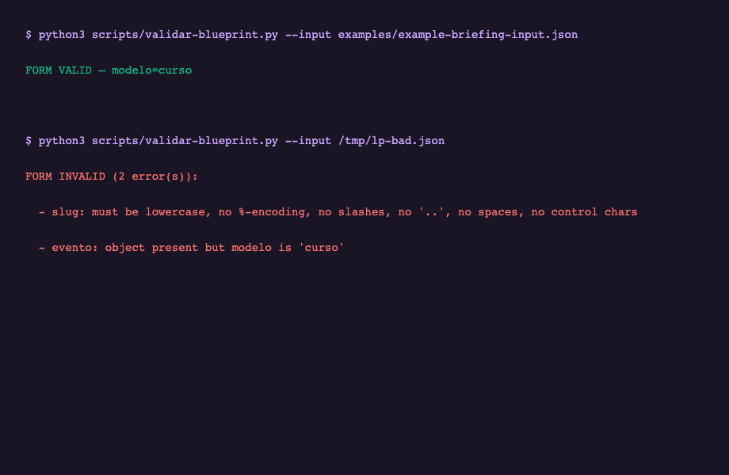
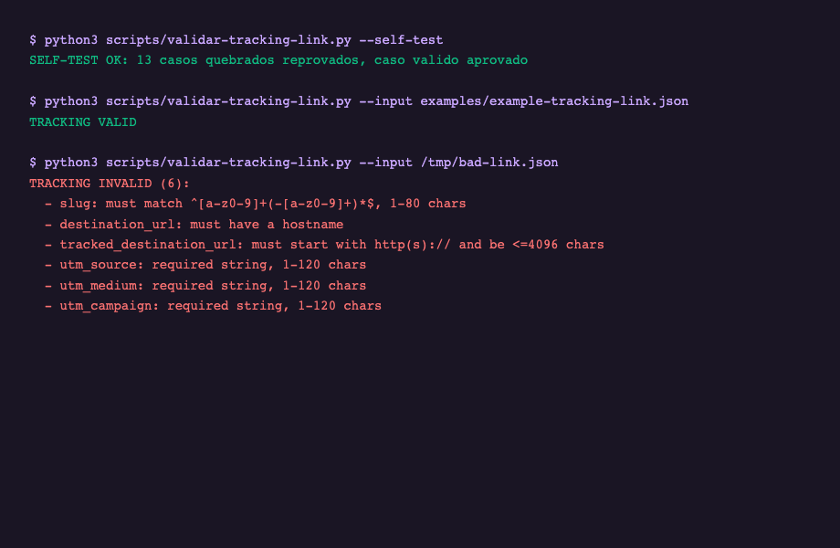

<p align="center">
  
</p>

<p align="center">
  
</p>

<h1 align="center">MARKETING 4.0</h1>

<p align="center">
  <strong>Digital Marketing in the Age of AI — o manual de montagem do seu ecossistema de marketing, peça por peça, como LEGO.</strong>
</p>

<p align="center">
  <a href="https://github.com/luisroquette"></a>
  
  
  
</p>

---

## Table of contents

- [Em 60 segundos](#em-60-segundos)
- [O mapa: o grafo do ecossistema](#o-mapa-o-grafo-do-ecossistema)
- [A tese: por que peças, e não uma plataforma](#a-tese-por-que-peças-e-não-uma-plataforma)
- [O funil em profundidade](#o-funil-em-profundidade)
- [As 8 peças, uma a uma](#as-8-peças-uma-a-uma)
- [Os contratos: a parte LEGO de verdade](#os-contratos-a-parte-lego-de-verdade)
- [Receitas: fluxos prontos de montagem](#receitas-fluxos-prontos-de-montagem)
- [O que o grafo revela](#o-que-o-grafo-revela)
- [Perguntas frequentes](#perguntas-frequentes)
- [Roadmap do ecossistema](#roadmap-do-ecossistema)
- [Limitações honestas](#limitações-honestas)
- [Licença](#licença)

---

## Em 60 segundos

Um funil de marketing tem seis estágios: atrair tráfego, converter em leads, nutrir os leads, vender, amplificar nas redes e medir tudo. Este superpack entrega cada estágio como uma **peça independente** — um repositório aberto, MIT, com contratos em Markdown e validadores determinísticos — e o **manual que mostra como elas se encaixam**. Você pode montar só a conversão (LP + tracking) numa tarde, ou o funil inteiro (SEO → LP → tracking → e-mail → vendas IA → social → observabilidade) ao longo de semanas. Cada peça funciona sozinha; o conjunto funciona como um sistema porque as peças se referenciam por **contratos**, não por código acoplado. O grafo interativo deste repo é o mapa dessas conexões — extraído dos próprios documentos dos sistemas, não desenhado à mão.

O resto deste README é o manual: cada peça em detalhe, cada plug explicado, receitas prontas e as perguntas que você faria antes de montar.

---

## O mapa: o grafo do ecossistema

**[Abra o grafo interativo](assets/grafo-marketing-4.0.html)** — baixe o arquivo e abra no navegador. São **204 conceitos e ~405 conexões** extraídos dos contratos dos sistemas, clusterizados por estágio do funil.

O grafo não foi desenhado: ele foi **construído a partir dos próprios documentos** dos repos (SKILL.md, references/, docs/, READMEs) com o pipeline graphify — extração semântica por agentes, quatro rodadas de lapidação para deduplicar conceitos e validar cada aresta contra evidência textual. Cada aresta do grafo tem uma frase de origem nos docs; arestas sem evidência foram **rejeitadas** na lapidação (ex.: o autoblog não usa tracking links, e o grafo diz isso pela ausência da aresta).

O que o grafo revela em um olhar:

- **O hub é o motor de e-mail** — o MailMKT concentra 45 conexões, porque o cockpit toca throttle, dispatcher, outbox, tracking e dashboard.
- **Três princípios atravessam os repos**: "ausência nunca é zero", "analytics nunca bloqueia entrega" e "gates em cascata" aparecem em documentos de sistemas diferentes sem se copiarem — o grafo os conecta por similaridade semântica.
- **O incidente é a arquitetura**: o nó do incidente de 17/08 (três e-mails em uma hora para um lead real) conecta-se ao throttle, ao dispatcher e ao outbox — o motivo de cada um existir.

---

## A tese: por que peças, e não uma plataforma

Plataformas de marketing fechadas vendem o funil inteiro de uma vez: você paga por estágios que não usa, não audita as regras que governam seu dinheiro, e fica preso quando o contrato muda. Este superpack parte da tese contrária:

1. **Cada estágio do funil é um problema diferente** — auditar SEO não é nutrir leads, e nutrir leads não é atribuir vendas. Resolver os seis com um produto só produz um produto medíocre nos seis.
2. **Os estágios só precisam se encontrar nos contratos** — a LP precisa saber o que é um clique (o tracklink define); o e-mail precisa saber quem é um lead (a LP entrega). Três tabelas de contrato resolvem isso; nenhum acoplamento de código é necessário.
3. **A auditabilidade é o produto** — as regras são prosa que você lê e validadores que você roda. "Como sabemos que o throttle funciona?" tem resposta: `npm test`, 107 testes.
4. **A honestidade é a marca** — ausência nunca é zero, anti-fabricação vence página bonita, e as limitações estão escritas em cada repo. O grafo registra até as conexões que NÃO existem (porque os docs não as sustentam).

Se você quer um funil de uma tarde, monte duas peças. Se quer o sistema da sua operação, monte as oito — a mesma disciplina, o mesmo padrão visual, os mesmos contratos.

---

<p align="center">
  <video src="assets/demo-funil.mp4" autoplay muted loop playsinline width="560"></video><br>
  <sub>O funil, animado — as seis peças se encaixando</sub>
</p>

## O funil em profundidade

O funil não é uma sequência linear de ferramentas — é uma cadeia de **transferências de responsabilidade**, e cada transferência é um contrato. Entender onde uma peça termina e a outra começa é o que torna a montagem previsível.

### Atrair — o tráfego entra

Dois motores produzem tráfego orgânico: a auditoria **SEO/GEO** (o plugin claude-seo, que otimiza para busca clássica E para citação por IA — cada recomendação responde "como saberíamos que falhou?") e o **autoblog** (conteúdo editorial contínuo, gerado de fontes reais com gate de compliance em runtime). A responsabilidade deles termina no clique: **eles não convertem**. O blog atrai; quem converte é a página — e por isso o autoblog, por contrato, não emite tracking links: a atribuição pertence à próxima peça.

### Converter — o clique vira lead

A **LP engine** constrói a página de venda (seis modelos, quatro gates, anti-fabricação como regra suprema), e o **tracklink** é o dono do contrato de clique. No momento da publicação, a LP cria o link trackeado do CTA; quando o visitante converte, a página grava `firstTrackingClickId` no lead. A transferência de responsabilidade é dupla: a página entrega o lead para o funil, e entrega a **origem** do lead para a atribuição.

### Nutrir — o lead não esfria

O **MailMKT** recebe o lead pelo contrato de intake e cuida da sequência de 25 dias sob um throttle compartilhado — um e-mail por lead por dia, garantido por 107 testes. Cada CTA do e-mail sai como um link `mailmkt-<slug>` do tracklink, então o nurture também atribui. O incidente que criou esta peça está documentado no repo: um lead real recebeu três e-mails em uma hora, e o throttle é a cicatriz que impede a repetição.

### Vender — a conversa fecha

A **marIA** vende por WhatsApp (catálogo, cases, autoridade — a conversa é a landing page) e o **motor Empiricus** roda a esteira evergreen e as campanhas de lançamento com gate de compliance em runtime. O sistema de propostas gera a proposta por IA. A atribuição da venda vem do cookie da peça de tracking — a venda acontece na conversa, mas a resposta "de onde veio esse cliente" continua vindo do contrato do tracklink.

### Amplificar — o alcance escala

A **Social Machine V3.1** publica reels e stories no Instagram com planejamento editorial. Ela produz alcance; o funil converte nas peças anteriores. A ponte entre as duas é a observabilidade, não o tracking.

### Medir — o tempo todo

O **ig-sentinel** lê quatro bancos Supabase em um cron diário e manda UM e-mail unificado — o estado do ecossistema em uma tela de inbox. O **contrato de métricas** do tracklink (janelas 7/30/90 calendar-filled, ausência ≠ zero) alimenta a dashboard unificada. Medir não é o último estágio do funil: é a camada que atravessa todos os outros.

---

## As 8 peças, uma a uma

### Peça 1 — SEO/GEO (Atrair)

- **O que faz:** audita o site para busca clássica e busca por IA com um plugin de 25 sub-skills e 18 agentes especialistas. O diferencial declarado: **falsificabilidade** — cada recomendação carrega o critério de falha.
- **Repo:** [`AgriciDaniel/claude-seo`](https://github.com/AgriciDaniel/claude-seo) (MIT, terceiro — referenciado, não forkado)
- **Instalar:** `git clone https://github.com/AgriciDaniel/claude-seo.git`
- **Plugar:** nenhuma dependência — é a porta de entrada. A conexão com o resto do funil é indireta: o gate de SEO da LP (metaTitle/metaDescription/JSON-LD) usa o mesmo padrão, e o conteúdo auditado é o que o autoblog publica.
- **Imagem real:** o repo inclui GIFs de demo do plugin rodando no terminal e o gráfico de crescimento real do autor.

### Peça 2 — Autoblog (Atrair)

- **O que faz:** conteúdo editorial autônomo — artigos gerados a partir de fontes reais, com compliance guard em runtime (mesmo padrão do gate do motor Empiricus). Referência viva no `cfgauss-site` (`app/api/cron/generate-article`).
- **Plugar:** ig-sentinel (monitora falhas do autoblog por janela de 3 dias). Não emite tracking links — o blog atrai, a LP converte, e o contrato mantém essa fronteira explícita.
- **Por que importa:** tráfego orgânico contínuo é o ativo mais barato do funil — mas só se alguém mede quando ele para de funcionar. O sentinel é esse alguém.

### Peça 3 — LP Engine (Converter)

- **O que faz:** páginas de venda a partir de um brief ou de uma URL, com **6 modelos** (universal, curso, evento, captura, squeeze, lançamento), **4 gates** (estrutura, regras, contraste WCAG AA, SEO) e **anti-fabricação** como regra suprema — preço, prazo ou credencial que não está na fonte é omitido, nunca inventado.
- **Repo:** [`luisroquette/My_LP_Makes_Neil_Proud`](https://github.com/luisroquette/My_LP_Makes_Neil_Proud)
- **Instalar:** `git clone https://github.com/luisroquette/My_LP_Makes_Neil_Proud.git`
- **Plugar:**
  - → **Tracklink**: cada CTA publicado vira um link trackeado; o lead grava `firstTrackingClickId`/`lastTrackingClickId`.
  - → **MailMKT**: o lead capturado entra no nurture pelo contrato de intake.
- **Cláusula pétrea:** o formulário de captura tem 3 campos (nome + telefone + e-mail). Reduzir exige aprovação do dono — o funil inteiro depende de um lead alcançável por telefone.
- **Imagem real:** o validator determinístico rodando no terminal (abaixo).



### Peça 4 — Tracklink UTM (Converter/Medir)

- **O que faz:** o dono do contrato de tracking — criação (slug `mailmkt-`/UTMs, destino query-free, anti-loop), clique (transacional, idempotente, `RETURNING (xmax = 0)`), atribuição (first/last click, camelCase no lead, snake_case na compra), saúde (SSRF-guard com revalidação por hop de redirect, detecção de bloqueio por datacenter) e métricas (7/30/90 calendar-filled).
- **Repo:** [`luisroquette/My_UTMs_Make_Me_Proud`](https://github.com/luisroquette/My_UTMs_Make_Me_Proud)
- **Instalar:** `git clone https://github.com/luisroquette/My_UTMs_Make_Me_Proud.git`
- **Plugar:** LP (produtora de links), MailMKT (todo CTA), dashboard unificada (métricas). O núcleo é canal-agnóstico: cada canal novo é um diretório em `integracoes/` com seu mapa hostname→utm_source.
- **Imagem real:** o validator com os 13 casos de regressão (abaixo).

<p align="center">
  <video src="assets/demo-tracking.mp4" autoplay muted loop playsinline width="560"></video><br>
  <sub>O ciclo de tracking, animado — o link atravessa o gate 302 até os destinos</sub>
</p>



### Peça 5 — MailMKT (Nutrir)

- **O que faz:** o cockpit de e-mail — throttle compartilhado (1 e-mail/lead/dia + 20h), um cron só com dispatcher por prioridade, outbox durável (claim/lease, dead-letter 23h, fail-closed), piso de copy no salvar E no enviar, e a dashboard demo com 6 telas.
- **Repo:** [`luisroquette/My_MailMKT_makes_Neil_Proud`](https://github.com/luisroquette/My_MailMKT_makes_Neil_Proud)
- **Instalar:** `git clone https://github.com/luisroquette/My_MailMKT_makes_Neil_Proud.git` · demo: `cd dashboard && npm install && npm run dev`
- **Plugar:** LP (intake de leads), Tracklink (CTAs `mailmkt-<slug>`), Resend/Supabase (adapters fiéis) — o núcleo é porta/adaptador, zero dependências.
- **Imagens reais:** as quatro telas da dashboard demo (abaixo).

<p align="center">
  <video src="assets/demo-cockpit.mp4" autoplay muted loop playsinline width="560"></video><br>
  <sub>O cockpit, animado — throttle, cinco motores e o calendário de colisões</sub>
</p>


### Peça 6 — Vendas com IA (Vender)

- **O que faz:** marIA vende por WhatsApp (o catálogo e os cases são a conversa); o motor Empiricus roda a esteira evergreen (drip de conteúdo) e campanhas de lançamento com gate de compliance em runtime; o sistema de propostas gera propostas por IA.
- **Onde mora:** referência viva no `cfgauss-site` (`lib/maria`, `lib/propostas`, motor Empiricus documentado em `docs/MOTOR-EMPIRICUS-CFGAUSS.md`).
- **Plugar:** a plataforma de cursos própria. Nota honesta do grafo: o agente de vendas não menciona LP/tracking nos docs — a venda acontece na conversa; a atribuição vem do cookie do tracklink gravado na compra.

### Peça 7 — Amplificação Social (Amplificar)

- **O que faz:** automação de Instagram — reels, stories, planejamento editorial e RADAR de conteúdo.
- **Onde mora:** Social Machine V3.1 (`luisroquette/social-machine-v3.1`).
- **Plugar:** ig-sentinel (monitora o IG). Produz alcance; o funil converte nas peças 3-5.

### Peça 8 — ig-sentinel (Medir)

- **O que faz:** observabilidade do ecossistema — um cron lê 4 bancos Supabase e manda UM e-mail diário unificado; o Doctor corrige automaticamente via webhook (protocolo de fix).
- **Onde mora:** `luisroquette/ig-sentinel`.
- **Plugar:** autoblog (conta falhas por janela), V3.1/SWEN/CF Gauss (estado do Instagram). É a peça que responde "o ecossistema está saudável?" em uma linha de e-mail por dia.

---

## Os contratos: a parte LEGO de verdade

As peças não se chamam por código — se referenciam por **contratos em Markdown**, cada um com um dono declarado. Quando dois contratos discordam, o dono vence. Esta tabela é o mapa de encaixe:

| Contrato | Dono | Consumidores | Regra central |
|---|---|---|---|
| O que é um clique, um lead e uma compra | Tracklink (`references/nucleo/`) | LP, MailMKT, dashboard | Transacional e idempotente: replay nunca conta duas vezes |
| Formulário de captura (3 campos) | LP (cláusula pétrea) | MailMKT (intake) | Nome + telefone + e-mail — reduzir exige aprovação do dono |
| Slug `mailmkt-<slug>` + UTMs | Tracklink (integração mailmkt) | MailMKT (todo CTA) | Um tracking link por ocorrência, nunca por lead |
| Métricas 7/30/90 calendar-filled | Tracklink (`metricas.md`) | Dashboard unificada | Ausência ≠ zero — dia sem dado é zero explícito, não linha ausente |
| Gate de publicação nunca contornado | LP | — | Valida ANTES de qualquer escrita |
| Piso de copy no salvar E no enviar | MailMKT (`piso.ts`) | — | Copy reprovada cai no seed e loga — nunca sai |
| Analytics nunca bloqueia entrega | os três repos | todos | Falha de métrica degrada e loga; o redirect é o produto |
| Anti-fabricação acima de tudo | LP (regra suprema) | geração de conteúdo | Preço/prazo/credencial ausente da fonte é omitido, nunca inventado |

**Por que contratos em Markdown e não SDKs?** Porque o consumidor pode ser qualquer stack — o contrato é prosa legível por humanos e por agentes, e o validador determinístico é a máquina que verifica. Nenhuma peça importa código de outra; todas leem o mesmo arquivo de regras. É isso que permite montar o funil com duas peças hoje e oito amanhã sem reescrever nada.

---

## Receitas: fluxos prontos de montagem

### Receita A — Funil completo (o ecossistema inteiro)

1. **Atrair:** clone o claude-seo e rode a auditoria no seu site; o autoblog publica conteúdo contínuo (referência no cfgauss-site).
2. **Converter:** clone LP + Tracklink → crie a página (brief ou URL), plugue o tracking na publicação, valide com `validar-blueprint.py`.
3. **Nutrir:** clone MailMKT → rode `npm test` (107 testes) → aponte o contrato de intake para os leads da LP → suba a demo (`cd dashboard && npm run dev`).
4. **Vender:** marIA/Empiricus no WhatsApp e nas campanhas (referência viva no cfgauss-site).
5. **Amplificar:** V3.1 publica reels/stories.
6. **Medir:** ig-sentinel manda o e-mail diário; a dashboard unificada consome as métricas do tracklink + as queries do cockpit.

### Receita B — Só conversão (2 peças, ~30 minutos)

LP Engine + Tracklink. A página captura o lead E atribui a origem. Ideal para validar oferta antes de construir o funil inteiro.

### Receita C — Só nutrição (1 peça, self-contained)

MailMKT com throttle, outbox e dashboard demo. Ideal para listas existentes que precisam de disciplina de envio.

### Regra de expansão

Adicione peças na ordem do funil, não na ordem do catálogo: só monte Nutrir depois que Converter produzir leads, e só monte Amplificar depois que o funil converter. O contrato de cada peça espera a anterior existindo.

---

## O que o grafo revela

- **O hub é o e-mail:** o MailMKT concentra ~45 conexões — o cockpit toca throttle, dispatcher, outbox, tracking e dashboard ao mesmo tempo.
- **Três princípios atravessam os repos:** "ausência nunca é zero", "analytics nunca bloqueia entrega" e "gates em cascata" — o grafo os conecta por similaridade semântica entre documentos de sistemas diferentes.
- **O incidente é a arquitetura:** o nó do incidente de 17/08 (três e-mails em uma hora) conecta-se ao throttle, ao dispatcher e ao outbox — o motivo documentado de cada um existir.
- **As ausências também são informação:** o grafo registra as conexões que NÃO existem (autoblog não usa tracking; o agente de vendas não nomeia a LP) — porque a lapidação rejeitou arestas sem evidência nos docs. Um mapa honesto mostra o que não está conectado.

---

## Perguntas frequentes

**Por onde começo?** Pela Receita B — duas peças, meia hora, e você já tem conversão com atribuição. O funil inteiro é uma expansão natural.

**Preciso dos 8 repos para funcionar?** Não. Cada peça funciona sozinha; os contratos existem para quando você plugar as próximas.

**Posso usar só as skills e não o código?** Sim — as skills são a metodologia portável; os repos públicos (LP, Tracklink, MailMKT) são as implementações de referência com validadores e testes.

**O claude-seo é de terceiro — como entra no pacote?** Referenciado, não forkado: MIT, com o link e o crédito claros. Ele ocupa o estágio Atrair, que era o vazio do ecossistema.

**O que o grafo tem a ver com o manual?** O grafo é a prova de que as conexões do manual existem nos contratos — cada aresta tem uma frase de origem. O manual é a leitura humana; o grafo é o mapa navegável.

**Posso contribuir com uma peça nova?** Sim — o padrão é: um repo com contratos em Markdown + validadores determinísticos + testes de regressão, e um plug que referencia os contratos existentes (veja `integracoes/` no tracklink para o template).

**O que significa "ausência nunca é zero"?** Dia sem dados é zero explícito; dado ausente é ausente. Um relatório que confunde os dois esconde quando o tracking parou de funcionar — e o grafo mostra esse princípio nos três repos.

**Por que o formulário de captura é uma cláusula pétrea?** Porque o funil inteiro depende de um lead alcançável por telefone — o nurture, o WhatsApp e o fechamento. Reduzir para "só e-mail" muda o que um lead É, e essa decisão é do dono do negócio, não de um template.

**Quanto custa?** Tudo MIT, zero licenças, zero vendors. O custo real é o seu tempo de montagem — e as receitas dizem exatamente o que montar primeiro.

---

## Roadmap do ecossistema

**Agora — consolidação.** Os três repos próprios publicados e interoperando; o claude-seo referenciado no estágio Atrair; o grafo lapidado (10 rodadas) e o manual publicado.

**Próximo — a dashboard unificada.** O contrato de métricas do tracklink + as queries documentadas do cockpit do MailMKT se encontram em uma tela: cliques por canal, leads por origem, envios por motor, saúde dos links.

**Depois — peças novas.** Cada canal novo entra como integração do tracklink (template pronto); cada modelo novo de LP segue o checklist de 16 pontos; cada motor novo do MailMKT segue o checklist documentado.

**Por fim — o grafo como produto.** O grafo cresce junto com os repos (o corpus é re-extraído a cada mudança de contrato) e vira o mapa oficial de qualquer novo consumidor do ecossistema.

---

## Limitações honestas

- **marIA e V3.1 são referências vivas, não repos públicos** — o código mora no cfgauss-site e no social-machine-v3.1; os contratos públicos deles são os docs citados aqui.
- **O grafo cobre os contratos, não o código inteiro** — 204 conceitos extraídos dos documentos; o código dos repos tem seus próprios grafos (o MailMKT tem o grafo do port; o cfgauss-site tem o grafo agêntico com 903 nós).
- **Atribuição entre conversa e cookie** — o agente de vendas não nomeia o tracking nos docs; a ponte é o cookie gravado na compra. Documentado, não escondido.
- **Este manual é uma foto de agosto de 2026** — o grafo se atualiza re-extraindo o corpus; o README se atualiza quando as peças mudam de versão.

---

## Licença

MIT — cada peça mantém sua própria licença (todas MIT). O claude-seo é MIT do autor original.

---

<p align="center">
  <sub>CF Gauss · MARKETING 4.0 — Digital Marketing in the Age of AI · monte peça por peça</sub>
</p>
---

## Tutorial de montagem, passo a passo

### Montando a Receita B (conversão) em 30 minutos

**Passo 1 — Clone as duas peças.**
```bash
git clone https://github.com/luisroquette/My_LP_Makes_Neil_Proud.git
git clone https://github.com/luisroquette/My_UTMs_Make_Me_Proud.git
```

**Passo 2 — Valide as máquinas.** Cada repo tem um validador determinístico que você roda ANTES de usar — se o self-test falha, a máquina está quebrada:
```bash
python3 My_LP_Makes_Neil_Proud/scripts/validar-blueprint.py --input My_LP_Makes_Neil_Proud/examples/example-briefing-input.json
python3 My_UTMs_Make_Me_Proud/scripts/validar-tracking-link.py --self-test
```
Dois "FORM VALID"/"SELF-TEST OK" significam que as peças estão íntegras.

**Passo 3 — Crie a página.** No repo da LP, escreva um brief (oferta, público, modelo, objetivo — as cinco decisões rápidas são selects, não JSON) ou cole a URL de uma página existente. O blueprint resultante passa pelos quatro gates antes de publicar.

**Passo 4 — Plugar o tracking.** Na publicação, o contrato do tracklink entra em ação: o CTA da página vira um link trackeado com slug e UTMs, e o lead grava o first-click id. O plug v2.1.0 da LP referencia o contrato — você não escreve código de tracking, você cumpre o contrato.

**Passo 5 — Confira a atribuição.** O primeiro lead que converter carrega `firstTrackingClickId`. A resposta "de onde veio" agora é uma coluna, não uma opinião.

### Montando a Receita A (funil completo)

A Receita A é a Receita B + quatro peças, na ordem do funil:

1. **Antes de converter, atraia** — rode o claude-seo no seu site (auditoria completa com os 32 comandos do plugin) e ligue o autoblog (referência: `cfgauss-site/app/api/cron/generate-article`). O sentinel passa a monitorar o autoblog.
2. **Monte a conversão** (Receita B completa).
3. **Plugar o nurture** — no repo do MailMKT: `npm install && npm test` (107 verdes), aponte o intake para os leads da LP, configure o throttle e os horários pela tela de regras da demo. Todo CTA do e-mail sai como `mailmkt-<slug>` automaticamente.
4. **Plugar as vendas** — marIA e o motor Empiricus (referência viva no cfgauss-site). O cookie do tracklink grava a origem na compra.
5. **Amplificar** — V3.1 para reels/stories; o sentinel monitora o IG.
6. **Medir** — o e-mail diário do sentinel + a dashboard unificada (métricas do tracklink + queries do cockpit).

### Depois de montado: o que você ganha

- **Uma resposta por pergunta de relatório:** de onde veio o lead (first-click), quem fechou (last-click), quantos e-mails cada lead recebeu (throttle), quais links estão quebrados (saúde), se o autoblog parou (sentinel).
- **Zero deploy para mudar regras:** cadência, horários, públicos e copy mudam por tela, não por commit.
- **Garantias testáveis:** 107 testes no e-mail, 13 casos no tracking, gates na LP. Se algo regride, o teste falha.

---

## Por que cada regra existe

As regras dos contratos não são preferências — cada uma tem um incidente ou um risco documentado atrás dela. Esta seção é o "porquê" do manual:

**Throttle de 1 e-mail/lead/dia.** Um lead real recebeu três e-mails em uma hora (lançamento 09:30, drip 10:01, mail mkt 10:30) porque cinco motores tinham cinco estados de throttle independentes. O fix — um estado compartilhado por rodada — é o coração do MailMKT, e um teste de regressão falha o build se as rotas antigas voltarem.

**Gate no salvar E no enviar.** O piso de copy existia no editor, mas o envio não o consultava — copy editada direto no banco furaria o gate. O contrato exige os dois pontos porque a revisão achou o furo.

**Dry mode sem efeito colateral.** O preview do dispatcher chegou a enviar e-mail real e a apagar reservas órfãs em modo de inspeção. A regra atual: dry não envia, não escreve tracking, não limpa nada — e um teste asserta isso.

**Ausência nunca é zero.** Três bugs reais em três repos trataram dado ausente como zero: blocos da dashboard mostravam "0 enviados" quando a leitura tinha falhado. A regra existe porque um zero falso manda o operador procurar problema na campanha em vez do pipeline.

**Anti-fabricação acima de tudo.** A extração de URL só monta o blueprint com o que existe na página — preço ausente é preço ausente. A regra é a suprema porque uma página bonita com preço inventado destrói a confiança que o funil inteiro precisa para converter.

**Analytics nunca bloqueia entrega.** Se o registro do clique falhar, o visitante é redirecionado mesmo assim. A regra é absoluta porque um tracking que derruba o redirect derruba a conversão — o custo de um clique não medido é menor que o de um cliente perdido.

**Fail-closed no outbox.** Timeout ou 5xx é ambíguo: o e-mail pode ter saído. A reserva é preservada e o e-mail nunca é reenviado na mesma rodada — duplicata é pior que lacuna, e o retry espera o mínimo de 20 horas.

**Redirects re-validam a guarda SSRF.** Um destino público que redireciona para um IP privado contornaria a guarda se só o primeiro host fosse checado. A regra cobre o bypass, não só o caso feliz.

**Renames não propagam.** Renomear um slug muda uma URL pública; links já emitidos mantêm o slug antigo. A regra é documentada (não escondida) para que os consumidores desenhem em torno dela — ferramentas que fingem migração automática produzem links quebrados em produção.

---

## Troubleshooting

**A LP publica mas o CTA não é trackeado** — o plug do tracklink não foi cumprido: confira se o contrato de publicação (`references/publicacao/contrato-tracklink.md`) está referenciado e se o link foi criado com o validador.

**O lead recebeu dois e-mails no mesmo dia** — impossível por construção, então algo furou: confira se o throttle foi carregado DEPOIS da limpeza de reservas órfãs (inverter a ordem libera um lead bloqueado) ou se o e-mail saiu por uma rota antiga (o teste de regressão cobre isso).

**A dashboard mostra zero enviados mas o cron rodou** — leitura que falha é `null`, nunca zero. Um zero real significa rodada sem candidatos; um `null` significa leitura quebrada. A distinção é o contrato.

**O autoblog parou de publicar** — o e-mail diário do sentinel deve mostrar o status; se não mostrou, o monitor não cobre o cron (confira a janela de 3 dias do relatório).

**O clique não conta no relatório** — confira se foi HEAD/prefetch (não contam por contrato), se o link está em loop `/t/` (o validador rejeita na criação) ou se o agregado foi incrementado fora da transação (a regra é `RETURNING (xmax = 0)`).

**O grafo não abre** — baixe o `assets/grafo-marketing-4.0.html` (não abra pelo preview do GitHub) e abra localmente no navegador.

---

## As peças contra o mercado

Para cada estágio, o que o mercado vende e o que a peça entrega:

| Estágio | Mercado | A peça |
|---|---|---|
| Atrair | Auditorias SEO de R$ 5-10k/mês, relatório em PDF | claude-seo: auditoria executável com falsificabilidade — cada recomendação diz como saber que falhou |
| Atrair | Gerador de artigo com copy genérica | Autoblog com gate de compliance em runtime e monitoramento próprio |
| Converter | Builders de página fechados, sem contrato | LP engine com 6 modelos, 4 gates e anti-fabricação — a página é auditável |
| Converter/Medir | Planilha de UTMs mantida à mão | Tracklink com validator de 13 casos — o link é o contrato |
| Nutrir | Plataforma de e-mail com regras invisíveis | MailMKT com throttle, outbox e piso — 107 testes que você roda |
| Vender | Follow-up manual no WhatsApp | marIA/Empiricus — a conversa é a landing page, com gate de compliance |
| Amplificar | Agência de social media | V3.1 com planejamento editorial autônomo e sentinel observando |
| Medir | Relatório mensal do funil | Contratos de métricas calendar-filled + e-mail diário do sentinel |

A diferença não é preço (tudo é MIT) — é **auditabilidade**. Numa plataforma, a regra que governa seu dinheiro é invisível. Aqui, a regra é um arquivo Markdown que você lê e um teste que você roda.

---

## Um dia na operação do funil completo

Às 09:00, o cron do sentinel lê os quatro bancos e monta o e-mail diário. Às 10:00, o dispatcher do MailMKT pergunta à agenda quem é da hora: o mail mkt e a esteira estão devidos, e o throttle compartilhado garante que nenhum lead receba mais de um e-mail — mesmo com dois motores na mesma rodada. Um lead clica no CTA do e-mail: o tracking link registra o clique transacionalmente e o redireciona para a LP em milissegundos. Na LP, ele converte: o lead grava o first-click id e entra no intake do nurture. À tarde, a marIA conversa com um lead no WhatsApp e fecha — a compra grava o last-click id. À noite, o autoblog publica o artigo do dia e o V3.1 sobe um reel. Amanhã, o e-mail do sentinel resume tudo em uma tela: envios, falhas, publicações, alertas.

Nenhuma etapa desse dia exigiu um deploy. Cadência, horários, públicos e copy mudam por tela; as regras mudam por contrato com teste; e cada número do relatório tem uma linha de origem no grafo.

---

## A história do ecossistema

O superpack não foi desenhado de cima — foi **extraído** de um sistema de produção, peça por peça, em agosto de 2026:

1. **O incidente.** Um lead real recebe três e-mails em uma hora. A investigação descobre cinco motores com cinco throttles independentes — e o cockpit (throttle compartilhado, um cron, outbox) nasce como o fix.
2. **A extração.** Cada sistema de produção vira uma skill pública com contratos em Markdown e validadores determinísticos: primeiro o tracking (v1.0.0), depois a LP (v2.1.0 com o plug do tracking), depois o e-mail (v2.0.0 com o cockpit completo).
3. **A lapidação.** Cada repo passa por rodadas de revisão adversária — 36 achados no MailMKT, 11 no tracklink, 9 na LP — com teste de regressão para cada bug class, e o critério de duas rodadas consecutivas limpas antes de publicar.
4. **O grafo.** Os contratos dos repos viram corpus, o graphify extrai 204 conceitos e ~405 conexões, e dez rodadas de lapidação deduplicam e validam cada aresta contra evidência textual.
5. **O manual.** Este README — a leitura humana do grafo, com as peças, os plugs e as receitas.

A ordem importa: o sistema existia antes do produto, os contratos antes do manual, e o grafo antes do mapa. Por isso cada afirmação deste README tem uma origem nos repos — e as ausências também são documentadas.

---

## Guia rápido de quem mantém

**Você é o dono da operação e quer saber o que observar:**

- **Toda segunda-feira:** leia o e-mail do sentinel (a semana inteira em uma tela). Zero achados é o normal — o alerta existe para quando não for.
- **Toda mudança de copy:** rode o piso antes de salvar (o editor já faz isso) e confira o gate no envio.
- **Todo relatório mensal:** confie nas janelas calendar-filled do tracklink; se um dia está ausente (não zero), o tracking parou — investigue o pipeline antes da campanha.
- **Toda regra nova:** escreva o contrato primeiro, o teste junto, e rode o self-test. A regra do repo é: fix e regressão no mesmo commit.

**Você é desenvolvedor e quer plugar uma peça nova:**

1. Leia o contrato do dono (ex.: `references/nucleo/` do tracklink).
2. Crie o diretório de integração (o template `modelo-nova-integracao.md` está pronto).
3. Escreva o validador para a sua forma de link/página/campanha.
4. Abra um PR — o bar de entrada é o teste de regressão no mesmo commit.

---

## As imagens e vídeos deste repo

Todas as imagens de produto são **capturas reais dos sistemas** (terminal rodando os validadores; as quatro telas da dashboard demo). As capas e os vídeos são gerados por IA no padrão visual CF Gauss (fundo `#1A1524`, roxo `#7B2FBE`, lilás `#C9A7FF`, as três ondas da logo) — os vídeos com o FLUX 3 Video e as capas com gpt-image-2. O grafo é o artefato mais honesto do repo: cada aresta tem uma frase de origem nos documentos.

---

---

## Por que confiar no grafo

Um mapa de marketing normalmente é um slide bonito desenhado por um consultor. Este grafo é diferente em três pontos:

1. **Extraído, não desenhado.** Os 204 nós vêm da extração semântica dos próprios documentos dos repos — cada nó tem um arquivo de origem e cada aresta tem uma frase que a sustenta. Nenhuma aresta foi adicionada sem evidência; as que não tinham foram rejeitadas em dez rodadas de lapidação.
2. **Lapidado com critério de convergência.** Cada rodada de revisão procurou duplicados, órfãos, arestas sem sustentação e conexões faltantes — e o loop só parou quando duas rodadas consecutivas não acharam nada. Os artefatos de cada rodada (`.lapidacao_r1.json` a `.lapidacao_r10.json`) são o audit trail do processo.
3. **Honesto sobre as ausências.** O grafo registra o que NÃO está conectado: o autoblog não usa tracking, o agente de vendas não nomeia a LP, o sentinel não cobre o e-mail. Um mapa que só mostra conexões te manda procurar integração onde ela não existe; este te mostra a fronteira real de cada peça.

---

## Comparativo de montagem

| Receita | Peças | Tempo estimado | O que você ganha |
|---|---|---|---|
| C — Nutrição | 1 | 1 hora (clone + testes + demo) | Disciplina de envio com throttle e outbox |
| B — Conversão | 2 | ~30 minutos a 1 tarde | Página que converte E atribui |
| A — Funil completo | 8 | 1-2 semanas, na ordem do funil | O sistema de marketing inteiro, auditável |

Os tempos são de montagem, não de aprendizado — cada repo tem seu README com o ciclo completo e os contratos. O aprendizado real é ler os contratos uma vez; depois, operar é tela e e-mail diário.

---

## Perguntas frequentes — a edição estendida

**O funil funciona sem o claude-seo?** Sim — ele é a peça de aquisição orgânica; você pode começar com tráfego pago ou listas existentes. O estágio Atrair só precisa de UM motor para o funil rodar.

**Por que o autoblog não emite tracking links?** Porque a fronteira do funil é o clique que converte. O blog atrai e educa; a LP converte e atribui. Emitir tracking no blog misturaria duas responsabilidades e inflaria o primeiro clique com tráfego que nunca converte. A ausência da aresta no grafo é a documentação dessa decisão.

**E se eu quiser um canal novo (WhatsApp, ads)?** O template `modelo-nova-integracao.md` do tracklink define o padrão: um diretório por canal, o mapa hostname→utm_source, e o contrato referenciado — o núcleo não muda. Ads e WhatsApp são os próximos da fila do roadmap.

**O que acontece quando um contrato muda?** O dono do contrato muda o Markdown, o validador ganha a regra nova com teste de regressão no mesmo commit, e os consumidores veem a mudança no diff do repo do dono. Nada quebra em silêncio — o teste do consumidor falha se o contrato mudou de forma incompatível.

**Por que os testes de regressão são obrigatórios e não opcionais?** Porque a memória de um sistema de produção é curta: um fix aplicado hoje pode ser removido inadvertidamente amanhã. O único guardião permanente é um teste que quebra o build. Cada bug class deste ecossistema — do XSS no render ao dry que enviava e-mail — tem seu teste, no mesmo commit do fix.

**O grafo serve para quê além de navegar?** Ele é o mapa de onboarding de qualquer pessoa nova no ecossistema (responda "como as peças se relacionam" apontando para o grafo), o audit trail das decisões de conexão (cada aresta tem origem), e a base da dashboard unificada (as comunidades são os módulos da tela).

**Este repo substitui os outros?** Não — é o índice e o manual. Os repos continuam donos dos contratos e do código; este repo referencia. O padrão é o mesmo do ecossistema: o dono vence, os consumidores referenciam.

**Como o padrão visual funciona nos três repos?** O CF Gauss Visual Standard (fundo `#1A1524`, roxo `#7B2FBE`, lilás `#C9A7FF`, Inter, a logo das três ondas) está gravado e aplicado em capas, terminais, dashboards e READMEs — qualquer peça futura herda o padrão.

**Posso comercializar serviços em cima?** Sim — o superpack é MIT. O que o ecossistema vende é a disciplina: auditoria, montagem e operação do funil. O software é o veículo; o contrato é o produto.

---
---

## A última palavra

Marketing 4.0 não é uma coleção de ferramentas — é uma disciplina de montagem. Cada peça deste pacote resolve um problema real do funil com um contrato auditável; cada plug entre peças é uma frase que você pode ler; e cada número do relatório tem uma linha de origem que o grafo aponta. O ecossistema funciona porque as peças respeitam o padrão: o dono define, os consumidores referenciam, os validadores verificam e os testes lembram.

Se você montar só uma peça, ela funciona sozinha. Se montar as oito, você tem um sistema de marketing inteiro que cabe num e-mail diário, numa tela de dashboard e num grafo navegável — e que responde, com número e não com opinião, a única pergunta que importa: **de onde veio a venda, e quanto custou chegar até ela.**

Monte peça por peça. Os contratos são o encaixe; os testes são a garantia; o grafo é o mapa.

---

<p align="center">
  <sub>CF Gauss · MARKETING 4.0 — Digital Marketing in the Age of AI · monte peça por peça</sub>
</p>
