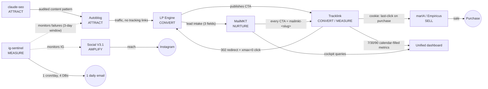

# How the pieces communicate

The full communication flow of the MARKETING 4.0 ecosystem — the map of who
talks to whom, and through which physical mechanism. Companion to the main
README and to the interactive graph (`assets/grafo-marketing-4.0.html`).

> GitHub renders the Mermaid block above as a live diagram. The same flow as
> machine-readable JSON: [`ecosystem-flow.json`](ecosystem-flow.json).

## How each connection actually works

| Connection | Real mechanism |
|---|---|
| **LP → Tracklink** | At publication, the LP creates the tracked link for the CTA. When the visitor converts, the LP records `firstTrackingClickId` on the lead (camelCase). |
| **Tracklink → destination** | 302 redirect. The click is recorded transactionally (`RETURNING (xmax = 0)`) and the visitor continues — analytics never blocks delivery. |
| **LP → MailMKT** | Intake contract: the 3-field lead (bedrock clause) enters the 25-day sequence. It is a data shape, not a code call. |
| **MailMKT → Tracklink** | Every email CTA goes out as a `mailmkt-<slug>` link — nurture also attributes origin. |
| **marIA → sale** | The conversation closes on WhatsApp; attribution comes from the tracklink **cookie** recorded on the purchase (last-click, snake_case on the purchase). |
| **autoblog → LP** | Traffic only. By contract, the blog does **not** emit tracking links — the LP converts, and the boundary is explicit in the graph. |
| **claude-seo → the rest** | No direct call. The link is the pattern: the LP's SEO gate (metaTitle/description/JSON-LD) follows the same methodology, and the audited content is what the autoblog publishes. |
| **V3.1 → funnel** | Produces reach on IG; the funnel converts in pieces 3-5. The bridge is observability (sentinel), not tracking. |
| **ig-sentinel → everyone** | Reads 4 Supabase databases through one daily cron and sends ONE email. The Doctor fixes issues via webhook (fix protocol). |
| **Tracklink → Dashboard** | 7/30/90 calendar-filled metrics + cockpit queries — absence ≠ zero. |

## The three principles that make this work

1. **Contracts, not SDKs** — no piece imports another's code. Every contract has a
   declared owner; when two disagree, the owner wins. It is prose readable by
   humans and agents, plus a deterministic validator.
2. **The physical communication is the data** — columns (`firstTrackingClickId`),
   redirects (302), cookies (attribution) and webhooks (sentinel). Nothing calls
   anything through internal APIs.
3. **Absences are contracts too** — the graph records what does NOT connect (the
   autoblog does not track, marIA does not name the LP), so you never go looking
   for an integration that does not exist.

The interactive graph (`assets/grafo-marketing-4.0.html`) is this same view with
204 nodes, where every edge carries a source sentence from the repos' documents.
