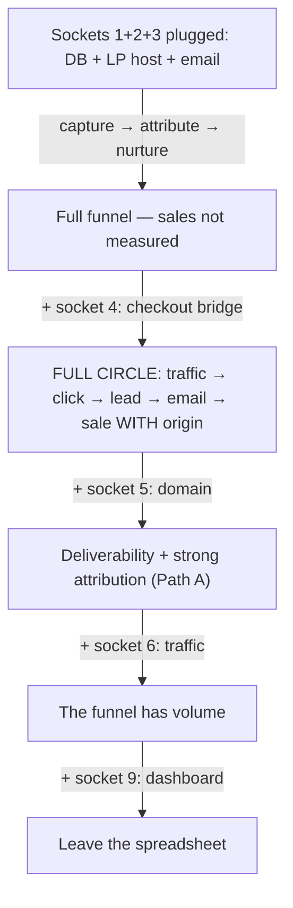

# Socket Registry Implementation Plan

> **For agentic workers:** REQUIRED SUB-SKILL: Use superpowers:subagent-driven-development (recommended) or superpowers:executing-plans to implement this plan task-by-task. Steps use checkbox (`- [ ]`) syntax for tracking.

**Goal:** Make the pack's 9 integration points (sockets) visible to non-technical owners via a registry file, consumed by wizard Phase 7 as a plug checklist + workspace snapshot, with self-test integrity assertions.

**Architecture:** One new reference file (`sockets.md`) acts as the single source of truth. Phase 7 of the skill reads it to render a per-socket status report and writes a `SOCKETS.md` snapshot into the owner's workspace. The self-test gains two assertions that guard the registry's integrity and the report's completeness.

**Tech Stack:** Markdown only. No code, no runtime. Verification via `grep`/`test` shell checks plus the dry-run scenario in `self-test-scenario.md`.

## Global Constraints

- All public files in English (repo vitrine rule); no internal brand names anywhere.
- Vocabulary: **socket** = integration point (data shape + rules); **plug** = the owner's chosen tool.
- Phase 7 consumes `references/sockets.md`; a missing file → report halts with "reference missing" (fail-visible, never improvise the list).
- Snapshot file is named `SOCKETS.md` and lives in the owner's workspace (`marketing40-setup/`).
- JSON twin + validator: deferred until a second consumer exists (do NOT create in this plan).
- README section and graph tags: deferred (do NOT touch README.md, assets/, docs/ contracts).
- Commit per task, local only — push only when the owner authorizes.

---

### Task 1: Self-test assertions (failing first)

**Files:**
- Modify: `.claude/skills/marketing40-onboarding/references/self-test-scenario.md`

**Interfaces:**
- Consumes: nothing.
- Produces: assertions 8 and 9, referenced by Tasks 2 and 3 as the definition of done.

- [ ] **Step 1: Append the two assertions**

Append to the end of the file, exactly:

```markdown
8. `references/sockets.md` exists and lists all 9 sockets with every required
   field filled (Socket, Contract, Required?, Reference plug, Alternative
   plugs, Locked without it).
9. The Phase 7 report renders one line per socket with a status — an empty
   socket is never silent.
```

- [ ] **Step 2: Verify assertion 8 fails against the current state (sockets.md does not exist yet)**

Run:

```bash
test -f .claude/skills/marketing40-onboarding/references/sockets.md && echo "PASS (unexpected)" || echo "FAIL as expected: sockets.md missing"
```

Expected: `FAIL as expected: sockets.md missing`

- [ ] **Step 3: Commit**

```bash
git add .claude/skills/marketing40-onboarding/references/self-test-scenario.md
git commit -m "test: add socket registry assertions to wizard self-test"
```

---

### Task 2: Create the socket registry

**Files:**
- Create: `.claude/skills/marketing40-onboarding/references/sockets.md`

**Interfaces:**
- Consumes: nothing (the vocabulary and the 9 sockets come from the approved spec `docs/superpowers/specs/2026-08-19-socket-registry-design.md`).
- Produces: the file that Task 3's Phase 7 reads; assertion 8's target.

- [ ] **Step 1: Write the registry file**

Create `.claude/skills/marketing40-onboarding/references/sockets.md` with exactly this content:

````markdown
# Sockets — where the owner plugs their own tools

The pack ships pieces and contracts; the rest of the world enters through
**sockets**. A socket is an integration point: a data shape plus rules. A
**plug** is the concrete tool the owner chooses and fits into it. The pack
ships reference plugs; the socket is what matters.

## The unlock chain



## The 9 sockets

| # | Socket | Contract | Required? | Reference plug | Alternative plugs | Locked without it |
|---|---|---|---|---|---|---|
| 1 | Postgres database | Transactional idempotent clicks (`RETURNING (xmax = 0)`); 7/30/90 calendar-filled metrics; shared throttle state | Yes | Supabase (Lovable ships one; free tier) | Neon, Railway Postgres | No tracking, no throttle, no cockpit |
| 2 | LP hosting | Publication gate validates before any write | Yes | Vercel | Lovable page (TODO-VERIFY), Netlify, Cloudflare Pages | The landing page never publishes |
| 3 | Email provider | Resend-style adapter; 1 email/lead/day; fail-closed outbox | Yes (for nurture) | Resend | Mailgun, Amazon SES, SMTP | Leads are captured and go cold |
| 4 | Checkout (sale source) | Attribution ends at the click; the bridge reads `firstTrackingClickId` or the same-domain cookie | The one that unlocks total potential | None — outside the pack by contract | Stripe, Mercado Pago, Pagar.me, Lovable checkout | The funnel never measures revenue |
| 5 | Domain + DNS | DKIM/SPF for the sender; cookie `Domain` attribute for attribution Path A | Should | Any registrar | Cloudflare, GoDaddy, Hostinger | Emails land in spam; Path A closed (Path B stays open) |
| 6 | Traffic | Tracked links with UTMs; analytics never blocks delivery | Should | claude-seo (organic) | Meta Ads, Google Ads, influencer links | Assembled funnel with no volume |
| 7 | SEO/GEO | Audit methodology; GEO citability | Optional | claude-seo (third-party, MIT) | Any SEO methodology | The Attract stage stays uncovered |
| 8 | AI generation | Anti-fabrication is supreme | Optional | Claude API | Any LLM, or none (manual copy) | Nothing breaks — copy becomes manual |
| 9 | Dashboard/reporting | 7/30/90 with absence ≠ zero | Optional today | The owner's spreadsheet | Metabase/Grafana, unified dashboard (roadmap) | The owner keeps the spreadsheet |

## Tiers

- **Must (1–3):** the funnel does not exist without them — plug first, in
  funnel order (Recipe B needs 1+2, Recipe C needs 1+3).
- **Should (5–6):** the funnel works without them but underperforms — the
  domain feeds deliverability and attribution; traffic feeds volume.
- **Optional (7–9):** accelerators and conveniences — nothing breaks while
  empty; copy becomes manual, reporting stays in the spreadsheet.

## Socket 4 — the revenue unlock

Every other socket improves a working funnel. Socket 4 is the only one that
changes what the funnel MEASURES: with it, the dashboard answers "how much
did the campaign sell" instead of "how many leads did it bring". The pack
stops at the click by contract — plugging checkout is the owner's move, and
`attribution-bridge.md` documents the two ways to do it.
````

- [ ] **Step 2: Verify the file exists and has all 9 sockets**

Run:

```bash
grep -c "^| [0-9] |" .claude/skills/marketing40-onboarding/references/sockets.md
```

Expected: `9`

- [ ] **Step 3: Verify assertion 8 now passes**

Run:

```bash
test -f .claude/skills/marketing40-onboarding/references/sockets.md && echo "PASS: sockets.md exists" || echo "FAIL"
```

Expected: `PASS: sockets.md exists`

- [ ] **Step 4: Commit**

```bash
git add .claude/skills/marketing40-onboarding/references/sockets.md
git commit -m "feat: add socket registry (9 sockets, unlock chain, tiers) to wizard"
```

---

### Task 3: Phase 7 consumes the registry (report + snapshot)

**Files:**
- Modify: `.claude/skills/marketing40-onboarding/SKILL.md` (Phase 7 section only)

**Interfaces:**
- Consumes: `references/sockets.md` (Task 2) and assertion 9 (Task 1).
- Produces: the "Plugs installed" report part and the `marketing40-setup/SOCKETS.md` snapshot — the final wizard deliverable.

- [ ] **Step 1: Replace the Phase 7 section**

Replace the current Phase 7 block in SKILL.md (from `### Phase 7 — Final report` down to `Save \`wizard-state.json\` and close.`) with exactly:

```markdown
### Phase 7 — Final report (owner's language, business words)

If `references/sockets.md` is missing (partial skill copy), say "reference
missing" and halt the report — never improvise the socket list.

Report five things:

1. **Verifiable NOW:** validators green, page live (URL), ad link ready, a test
   lead injected carrying its origin.
2. **Awaiting real traffic:** anything that only shows up once visitors arrive.
3. **Not working yet:** purchase attribution (if Phase 6 was skipped) and the
   unified dashboard (roadmap item — keep the spreadsheet for now).
4. **Plugs installed:** read `references/sockets.md` and render one line per
   socket — ✓ plugged (name the tool) / ⚠ partial / ✗ empty (state what stays
   locked). An empty socket is never silent.
5. **Week 1:** a five-line checklist including sender-domain DKIM/warm-up
   before the first real campaign.

Write the snapshot `marketing40-setup/SOCKETS.md` — the same 9 rows with the
owner's choices filled in (socket, status, chosen tool, what is locked) — the
"my stack" page the owner keeps. Save `wizard-state.json` and close.
```

- [ ] **Step 2: Verify the new Phase 7 text is in place**

Run:

```bash
grep -c "Plugs installed" .claude/skills/marketing40-onboarding/SKILL.md && \
grep -c "SOCKETS.md" .claude/skills/marketing40-onboarding/SKILL.md && \
grep -c "reference missing" .claude/skills/marketing40-onboarding/SKILL.md
```

Expected: three lines, each `1`.

- [ ] **Step 3: Full verification — run the wizard self-test dry-run**

Run the dry-run scenario in `.claude/skills/marketing40-onboarding/references/self-test-scenario.md` (mock Lovable owner, canned answers, zero side effects) and confirm every assertion holds, including the new 8 and 9.

Expected: all 9 assertions pass.

- [ ] **Step 4: Commit**

```bash
git add .claude/skills/marketing40-onboarding/SKILL.md
git commit -m "feat: Phase 7 renders plug checklist per socket and writes SOCKETS.md snapshot"
```

---

## Self-Review (ran by the plan author)

- **Spec coverage:** Artifact 1 → Task 2; Artifact 2 (report part 5 + snapshot) → Task 3; Artifact 3 (assertions 8–9) → Task 1; error handling (missing file → halt) → Task 3 Step 1. Decision log constraints (no JSON, no README/graph) → Global Constraints. No gaps.
- **Placeholder scan:** every step carries its exact content; no TBDs.
- **Type consistency:** file names (`references/sockets.md`, `SOCKETS.md`, `self-test-scenario.md`, `SKILL.md`) and assertion numbers (8, 9) match across tasks.
