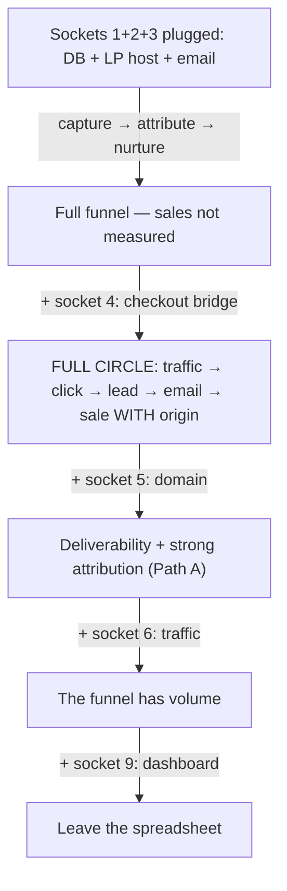

# Socket registry for the MARKETING 4.0 pack — design spec

Date: 2026-08-19 · Status: approved · Scope: onboarding wizard (`marketing40-onboarding` skill)

## Problem

The pack already speaks plugs and contracts on the technical layer
(`integracoes/` in tracklink, plug v2.1.0 in the LP, Markdown contracts), but
the outward-facing question — "where do I plug MY tools?" — has no home. The
only place the README touches it is prose ("whatever checkout you use is
outside the pack"). A non-technical owner cannot see which connection points
exist, which ones are required, and what stops working while a socket is empty.

## Goals / non-goals

Goals:

- Make every integration point (socket) identifiable and nameable.
- Show the possibilities per socket (reference plug + alternatives).
- Show what must be plugged to unlock the full funnel, ranked in tiers.
- Make the wizard consume the registry so the owner ends onboarding with a
  living checklist of their own stack.

Non-goals (explicitly deferred):

- README section, socket tags in the interactive graph, JSON twin + validator.
  The JSON twin is born when a second consumer exists (graph or dashboard).
- Automatic snapshot updates as pieces change; the snapshot is wizard-written.

## Vocabulary

- **Socket** — an integration point of the pack: a data shape + rules (the
  contract). Owned by the pack.
- **Plug** — the concrete tool the owner chooses and fits into a socket.
  The pack ships reference plugs; the socket is what matters.

## The 9 sockets

| # | Socket | Contract | Required? | Reference plug | Alternative plugs | Locked without it |
|---|---|---|---|---|---|---|
| 1 | Postgres database | Transactional idempotent clicks (`RETURNING (xmax = 0)`); 7/30/90 calendar-filled metrics; shared throttle state | Yes | Supabase (Lovable ships one; free tier) | Neon, Railway Postgres | No tracking, no throttle, no cockpit |
| 2 | LP hosting | Publication gate validates before any write | Yes | Vercel | Lovable page (TODO-VERIFY), Netlify, Cloudflare Pages | The landing page never publishes |
| 3 | Email provider | Resend-style adapter; 1 email/lead/day; fail-closed outbox | Yes (for nurture) | Resend | Mailgun, Amazon SES, SMTP | Leads are captured and go cold |
| 4 | Checkout (sale source) | Attribution ends at the click; the bridge reads `firstTrackingClickId` or the same-domain cookie | The one that unlocks total potential | None — outside the pack by contract | Stripe, Mercado Pago, Pagar.me, Lovable checkout | The funnel never measures revenue |
| 5 | Domain + DNS | DKIM/SPF for the sender; cookie `Domain` attribute for attribution Path A | Should | Any registrar | Cloudflare, GoDaddy, Hostinger | Emails land in spam; Path A closed (Path B stays open) |
| 6 | Traffic | Tracked links with UTMs; analytics never blocks delivery | Should | claude-seo (organic) | Meta Ads, Google Ads, influencer links | Assembled funnel with no volume |
| 7 | SEO/GEO | Audit methodology; GEO citability | Optional | claude-seo (third-party, MIT) | Any SEO methodology | The Attract stage stays uncovered |
| 8 | AI generation | Anti-fabrication is supreme | Optional | Claude API | Any LLM, or none (manual copy) | Nothing breaks — copy becomes manual |
| 9 | Dashboard/reporting | 7/30/90 with absence ≠ zero | Optional today | The owner's spreadsheet | Metabase/Grafana, unified dashboard (roadmap) | The owner keeps the spreadsheet |

## Unlock chain

Socket 4 is the only one separating "funnel operating" from "funnel measuring
money" — the registry gives it a callout of its own.

## Design

### Artifact 1 — `references/sockets.md` (in the skill folder, English, ~100 lines)

1. **How to read this map** — socket vs plug in three lines, reusing the
   pack's existing plug vocabulary.
2. **Unlock chain** — the mermaid above.
3. **Master table** — the 9 sockets with all six columns.
4. **Tiers** — must / should / optional, with the funnel-order expansion rule.
5. **Socket 4 callout** — checkout, the revenue unlock.

### Artifact 2 — SKILL.md Phase 7 consumes the registry

- The final report gains a fifth part: **Plugs installed** — a checklist per
  socket: ✓ plugged (which tool) / ⚠ partial / ✗ empty (what stays locked).
- The wizard writes a snapshot `SOCKETS.md` into the owner's workspace — the
  "my stack" page the owner keeps after the session.

### Artifact 3 — Self-test gains two assertions

8. `sockets.md` lists all 9 sockets with every required field filled.
9. The Phase 7 report renders a status per socket — an empty socket is never
   silent.

## Error handling

If `references/sockets.md` is missing (partial copy of the skill), Phase 7
reports "reference missing" and halts the report — fail-visible, matching the
pack's own philosophy.

## Decision log

- **Layer first:** registry + wizard only (chosen by owner); README and graph
  later.
- **Approach:** registry with visual unlock chain (approach 1 of 3); the
  machine-verifiable JSON twin is deferred until a second consumer exists.
